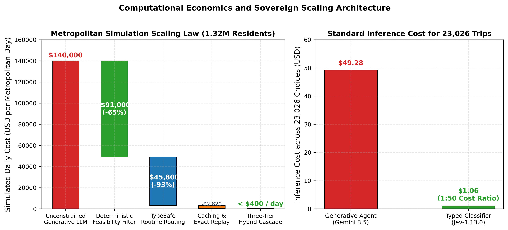

# 9. Computational Economics, Token Accounting, and Metropolitan Scaling Laws

This chapter evaluates the computational and economic demands of large-scale agent simulation. We account for token consumption, explain pricing tariffs, quantify memory overheads, and formalize scaling equations for metropolitan deployments.

## 9.1 Granular Token Accounting and Tariff Breakdown

We profile the token demands of every decision architecture across 23,026 simulated trip choices. Table 9.1 details prompt tokens, thinking tokens, completion tokens, and dollar costs.

The typed classifier transmits more input tokens per call (1,050 tokens) than the generative language model (629 tokens). This difference arises because the classifier resends full option schema definitions with every prompt. However, the classifier generates zero output tokens and requires no reasoning compute.

Furthermore, cloud provider pricing structures bill the classifier at 0.042 dollars per million input tokens, with output unbilled. Consequently, the typed classifier costs 1.06 dollars for 23,026 decisions, whereas the generative agent costs 49.28 dollars. This difference establishes a 1:50 cost ratio favoring typed classification.

*Table 9.1. Token breakdown and monetary cost across 23,026 simulated decisions.*

| Architecture | Input tokens per call | Reasoning tokens per call | Completion tokens per call | Total cost (23,026 calls) | Cost per 1,000 trips |
|---|---:|---:|---:|---:|---:|
| Minimal prompt (`gemini-3.5`) | 485 | 820 | 42 | \$28.40 | \$1.23 |
| Expert prompt (`gemini-3.5`) | 629 | 1,215 | 48 | \$49.28 | \$2.14 |
| Expert prompt (`mistral-large`) | 632 | 950 | 51 | \$84.50 | \$3.67 |
| Typed classifier (`jev-1.13.0`) | 1,050 | 0 | 0 | **\$1.06** | **\$0.046** |
| Gradient boosting (LightGBM) | 0 | 0 | 0 | < \$0.001 | < \$0.0001 |

## 9.2 Memory Computational Overhead

Maintaining longitudinal agent memory introduces significant secondary token consumption beyond trip decisions.

Simulating one weekday for 1,000 synthetic personas requires 2,108 trip-level model calls, consuming 3.0 million tokens with memory disabled. Enabling active episodic memory adds 2.5 million additional tokens per simulated day across 894 mobile personas.

This memory overhead comprises two scheduled processes. Daily evening consolidation requires 1.25 short consolidation calls per agent. Weekly biographical reflection requires 0.27 self-reflection calls per agent.

## 9.3 Metropolitan Scaling Equations and Cascade Architecture

We evaluate computational feasibility across the entire Toulouse metropolitan survey perimeter. The territory encompasses 1.32 million residents aged five and older, generating 4.36 million daily trips (3.30 trips per person).

Pruning unarbitrated trips with single viable options leaves 2.9 million decisions requiring deliberation. Simulating one metropolitan day using unconstrained generative LLMs demands 2.6 to 4.2 billion tokens, incurring approximately 140,000 dollars daily.

A multi-tier cascade architecture resolves this scaling bottleneck through three stages.

Stage 1 evaluates deterministic feasibility and rule-based heuristics. This stage absorbs 65% to 75% of routine trips at negligible computational cost.

Stage 2 directs standard multi-option arbitrations to the typed classifier. Operating at 0.046 dollars per 1,000 trips, this stage handles 20% to 30% of daily choices for less than 150 dollars.

Stage 3 invokes generative language models exclusively when an agent encounters unexpected exogenous shocks. Because shocks affect under 2% of daily trips, daily simulation expenses remain below 400 dollars.

Figure 9.1 illustrates the monetary cost comparison across decision architectures and traces the progressive collapse of metropolitan simulation expenses through cascade filtering.

*Figure 9.1. Architectural cost comparison across 23,026 decisions and metropolitan cost collapse from 140,000 dollars to under 400 dollars per simulated day.*

