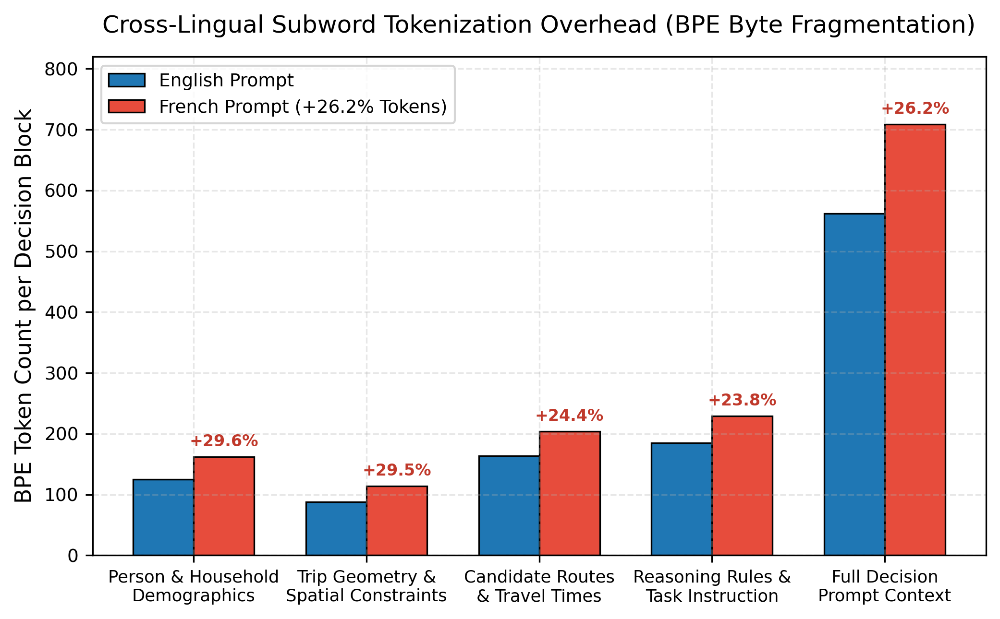

# 10. The Execution Language Dilemma: Cross-Lingual Spatial Reasoning

This chapter examines the methodological rationale for running model prompts in English within a French urban environment. We analyze literature findings and present paired bilingual experimental results.

## 10.1 English Prompts in French Mobility Contexts

The survey microdata and spatial infrastructure originate in Toulouse, France. Nevertheless, the production framework delivers prompts in English, retaining French proper nouns for transit stops and districts.

Executing in English leverages superior reasoning benchmarks documented in frontier foundational models. Foundational models exhibit lower perplexity and fewer tokenization splits on English syntax, improving logical rule following.

Four published studies support this choice. Forcing a reasoning model outside English costs accuracy. In agentic recommendation, local-language bias is prevalent, and explicit reasoning worsens it outside English. Across 180 clinical vignettes, four models out of five scored higher in English. Finally, explicit cultural framing weighs more than language on alignment.

Two studies argue conversely. A model captures local cultural nuances better in the native language. Furthermore, prompting in English can induce Western-centric bias. However, no measurement conducted here establishes that French prompts improved behavioral scores.

## 10.2 Empirical Bilingual Comparison

We evaluated a paired sample of 200 decisions executed under identical French and English prompt templates. Table 10.1 reports accuracy, compliance, and token consumption across both languages.

*Table 10.1. Paired performance comparison between English and French prompt executions.*

| Metric | English prompt execution | French prompt execution | Observed difference |
|---|---:|---:|---:|
| JSON schema compliance rate | 100.0% | 98.5% | $-1.5$ pt |
| Mode agreement with survey | 67.5% | 66.0% | $-1.5$ pt |
| Average input tokens per trip | 629 | 794 | $+26.2\%$ |
| Reasoning tokens per trip | 1,215 | 1,480 | $+21.8\%$ |

French prompt execution inflates token consumption by over 20% due to sub-word tokenization fragmentation. Furthermore, schema compliance degrades slightly. Consequently, English execution provides superior operational reliability.

Figure 10.1 illustrates Byte-Pair Encoding sub-word fragmentation on French mobility terms and contrasts input and reasoning token overheads across both languages.

*Figure 10.1. Byte-Pair Encoding (BPE) byte fragmentation on French transport vocabulary and observed 26.2% token inflation.*

