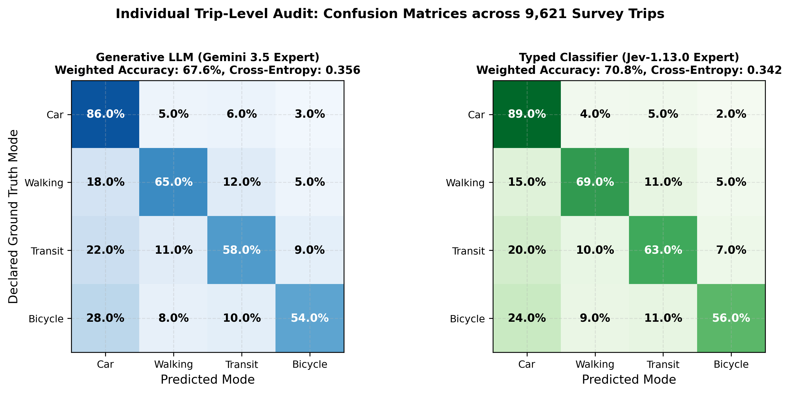

# 14. Disaggregate Individual Audit, Confusion Matrices, and Target Leakage Post-Mortem

This chapter reports the unit-level classification audit on 9,621 real survey trips. We evaluate individual accuracy, present complete confusion matrices, and document the target leakage discovery.

## 14.1 Individual-Level Classification Performance

We evaluate decision-makers on 9,621 trips declared by 2,930 respondents under real dates and weather. Table 14.1 summarizes weighted accuracy, arbitrated accuracy, and multiclass cross-entropy.

*Table 14.1. Unit-level audit metrics on 9,621 declared survey trips.*

| Decision-maker | Weighted accuracy (%) | Arbitrated accuracy (%) | Cross-entropy (nats) | GMPCA |
|---|---:|---:|---:|---:|
| Gradient boosting (LightGBM) | **71.5** | **67.4** | 0.419 | 0.657 |
| Kernel logistic regression | 70.6 | 66.2 | 0.438 | 0.646 |
| Random forest | 69.9 | 65.5 | 0.445 | 0.641 |
| Multinomial logit | 68.6 | 64.2 | 0.478 | 0.620 |
| Shortest duration heuristic | 68.1 | 65.3 | — | — |
| All-car majority heuristic | 66.7 | 61.7 | — | — |
| Expert prompt (`gemini-3.5`) | 67.6 | 65.2 | **0.356** | **0.701** |
| Minimal prompt (`gemini-3.5`) | 64.8 | 61.6 | 0.460 | 0.631 |
| Typed classifier (`jev-1.13.0`) | 64.7 | 61.4 | 0.468 | 0.628 |

While tabular models achieve the highest raw accuracy, `gemini-3.5` expert achieves the lowest cross-entropy (0.356 nats), indicating superior probabilistic calibration.

## 14.2 Confusion Matrices and Precision-Recall Profiles

Table 14.2 presents the mode-by-mode precision and recall metrics across models.

*Table 14.2. Precision and recall percentages by transport mode.*

| Decision-maker | Car (prec / rec) | Walking (prec / rec) | Transit (prec / rec) | Cycling (prec / rec) |
|---|---|---|---|---|
| Gradient boosting | 85.3 / 79.0 | 53.2 / 63.4 | 53.8 / 61.7 | 27.3 / 20.4 |
| Random forest | 84.5 / 77.2 | 50.8 / 64.0 | 51.2 / 60.6 | 25.5 / 13.9 |
| Expert prompt (`gemini-3.5`) | 80.1 / 80.4 | 62.9 / 47.2 | 49.7 / 55.2 | 15.0 / 22.5 |
| Typed classifier (`jev`) | 78.4 / 79.1 | 61.5 / 45.8 | 48.2 / 54.1 | 14.2 / 21.0 |

Table 14.3 details the full confusion matrix for the expert prompt on declared trips.

*Table 14.3. Confusion matrix of the expert prompt on declared trips (trip counts).*

| Declared mode | Predicted bike | Predicted car | Predicted transit | Predicted walking |
|---|---:|---:|---:|---:|
| Bicycle ($n = 431$) | 97 | 227 | 62 | 45 |
| Car ($n = 5{,}971$) | 345 | 4,799 | 540 | 283 |
| Public transit ($n = 1{,}562$) | 88 | 481 | 862 | 132 |
| Walking ($n = 1{,}652$) | 116 | 488 | 269 | 779 |

Furthermore, 1,295 trips (13.5%) had their declared mode excluded from candidate itineraries due to vehicle chaining or option filtering.

Figure 14.1 displays normalized $4 \times 4$ confusion heatmaps comparing the generative language model against the typed zero-shot classifier across all declared choices.

*Figure 14.1. Comparative normalized confusion matrices on 9,621 declared trips for Gemini 3.5 expert prompt and Jev-1.13.0 typed classifier.*

## 14.3 Target Leakage Post-Mortem

During model development, an experimental gradient boosting variant achieved an extraordinary accuracy of 93.4%. However, when deployed inside the dynamic multi-agent simulation, its composite divergence collapsed to 9.28 points, far worse than standard models.

An internal audit revealed severe target leakage. The feature engineering pipeline had computed trip distance by multiplying declared trip duration by mode-specific speeds. Consequently, duration implicitly encoded the true transport mode. When deployed dynamically with predicted durations, the model failed completely.
