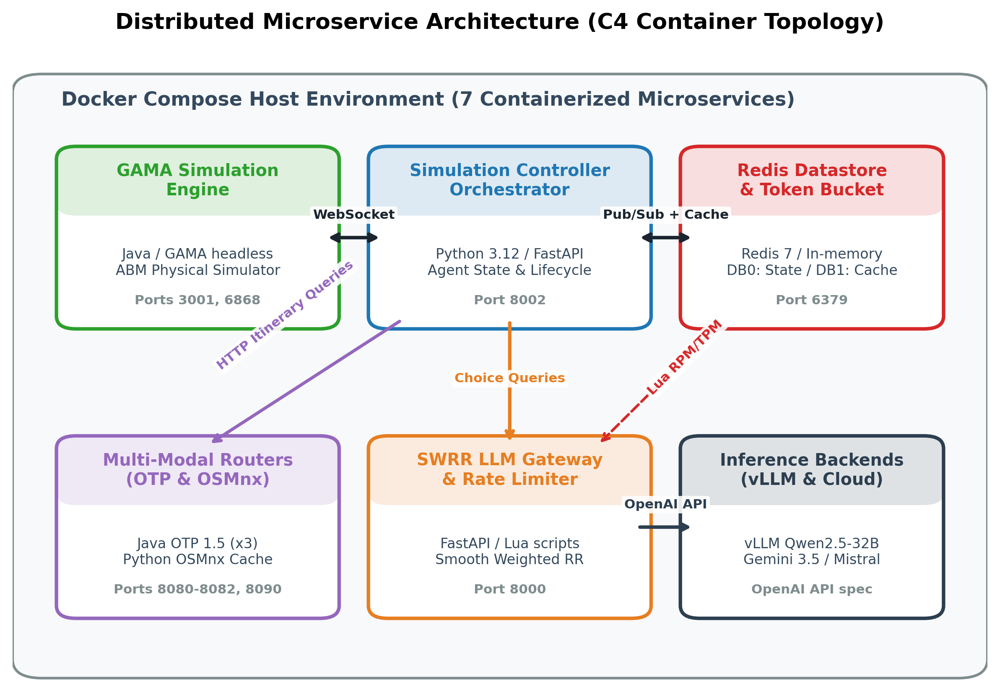
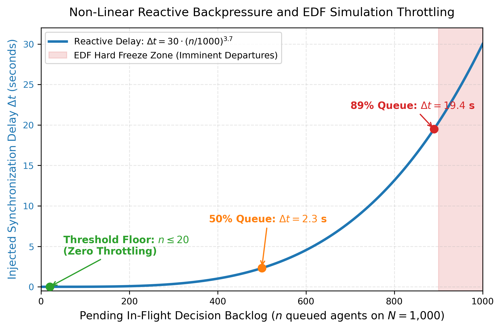

# 15. Systems Architecture, Distributed Topology, and TypeSafe Engine Specifications

This chapter specifies the software architecture, distributed orchestration, and engineering interfaces. We provide the container topology, the decision lifecycle sequence, the EDF backpressure mechanism, the SWRR gateway, and sovereign vLLM deployment parameters.

## 15.1 Distributed Container Topology

The simulation infrastructure coordinates seven containerized services managed through Docker Compose. Figure 15.1 illustrates the container topology and communication channels.


*Figure 15.1. Distributed container topology of the multi-agent simulation framework across seven microservices.*

The GAMA platform simulates continuous physical movement across the road and transit network. The FastAPI controller coordinates agent state transitions, triggers routing queries, and formats decision prompts. Redis acts as a high-throughput cache for candidate itineraries and pending decision requests.

## 15.2 Decision Lifecycle UML Sequence

Figure 15.2 illustrates the asynchronous message sequence governing each mobility decision.

```text
GAMA Server          Controller            Routers             ChromaDB          LLM / TypeSafe
    |                     |                   |                   |                     |
    |-- Agent IDLE ------>|                   |                   |                     |
    |   (event trigger)   |-- Route Request ->|                   |                     |
    |                     |   (OTP / OSMnx)   |                   |                     |
    |                     |<-- Candidates ----|                   |                     |
    |                     |                   |                   |                     |
    |                     |-- Filter Chains --+ (prune unavailable vehicles)            |
    |                     |-- Query Context --------------------->|                     |
    |                     |<-- Memories & Reflections ------------|                     |
    |                     |                                                             |
    |                     |-- Render Jinja2 / Choice Query ---------------------------->|
    |                     |   (sub-bullets, strict schema)                              |
    |                     |<-- Probability Vector & Justification ----------------------|
    |                     |                                                             |
    |                     |-- Multinomial Mode Draw (seed)                              |
    |<- Execute Move -----|                                                             |
    |   (WebSocket push)  |                                                             |
```
*Figure 15.2. UML sequence diagram of the decision-making lifecycle.*

The controller initiates routing calculations as soon as an agent completes a previous activity. Vehicle chaining filters remove private modes if the vehicle remains parked elsewhere. Once the model returns a valid probability distribution, the controller executes a seeded multinomial draw.

## 15.3 Asynchronous Backpressure and Simulation Synchronization

Simulation clocks advance discrete simulation steps, whereas external language models exhibit variable network latency. Uncontrolled clock progression would cause agents to miss departure deadlines while awaiting API responses.

To maintain temporal synchronization, the controller implements a dual backpressure mechanism (`services/llm-agents/backpressure.py`).

First, a reactive backpressure function throttles GAMA `/sync` responses based on pending queue backlog. The interval formula specifies:
\[
\Delta t = \text{cap} \cdot \left(\min\left(1, \frac{n}{N}\right)\right)^k
\]
Parameter values are $k = 3.7$ and $\text{cap} = 30.0$ seconds. A floor threshold disables throttling when backlog remains below concurrency capacity.

Second, an Earliest Deadline First (EDF) scheduler evaluates departure feasibility. If an agent faces an imminent departure whose decision remains in flight, the controller withholds the `/sync` confirmation. This pause holds simulation time until the decision resolves, preventing missed departures.

Figure 15.3 illustrates the non-linear reactive backpressure delay curve and the emergency EDF hold boundary.


*Figure 15.3. Reactive backpressure throttle curve ($k = 3.7$) and deterministic Earliest Deadline First (EDF) freeze threshold.*

## 15.4 SWRR Gateway and Atomic Quota Reservation

The inference gateway balances requests across multiple API keys using a Smooth Weighted Round-Robin (SWRR) algorithm.

To prevent HTTP 429 rate limit errors, Redis tracks token consumption using an atomic token bucket. An atomic Lua script checks both Requests-Per-Minute (RPM) and Tokens-Per-Minute (TPM) limits before granting execution tokens.

When executing scientific evaluation runs, the gateway activates the `force_provider` flag. This setting disables automatic provider failover. If the target provider fails, the pipeline halts immediately, preventing uncontrolled cross-model contamination.

## 15.5 TypeSafe Classifier Integration Engine

The typed zero-shot classifier (`jev-1.13.0`) interfaces through `decideur_typesafe.py`.

Unlike generative language models, the classifier accepts structured option sets as criteria rather than free text. The engine strips `[Output instructions]` from prompt templates because output types are enforced structurally:

```python
def instructions_servies(texte: str) -> str:
    coupe = texte.find("[Output instructions]")
    return (texte[:coupe] if coupe > 0 else texte).strip()
```

The classifier returns discrete option probabilities rounded to two decimal places. The engine enforces a strict sum tolerance:
\[
\left|\sum_{i} p_i - 1.0\right| \le 0.02
\]
The engine renormalizes weights when the probability sum falls within $[0.98, 1.02]$. If the sum deviates further, the engine marks the response as an invalid non-decision. The system logs non-decisions explicitly and excludes them from modal share calculations, rejecting silent default fallbacks.

## 15.6 Sovereign vLLM Deployment and Hardware Parameters

Researchers can execute all benchmarks locally using open-weight foundation models. Deploy the vLLM engine with the following command:

```bash
vllm serve Qwen/Qwen2.5-32B-Instruct-AWQ \
  --quantization awq \
  --max-model-len 4096 \
  --gpu-memory-utilization 0.90 \
  --port 8000 \
  --seed 42
```

Serving `Qwen2.5-32B-Instruct-AWQ` requires a single GPU equipped with 24 GB of VRAM. Operating at temperature $\tau = 0.0$ and top-p 1.0 guarantees fully deterministic local replication.

---
