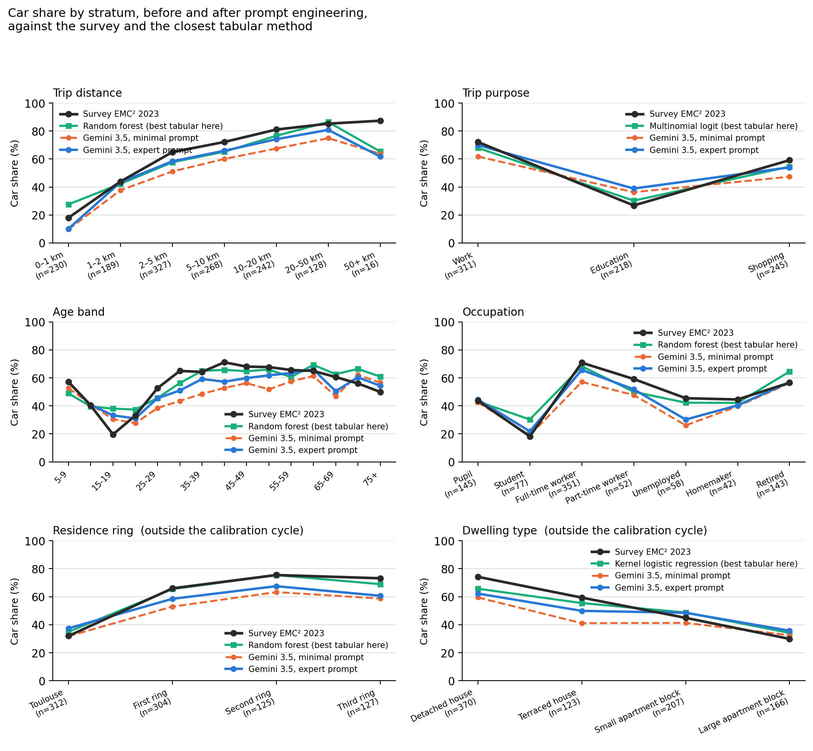
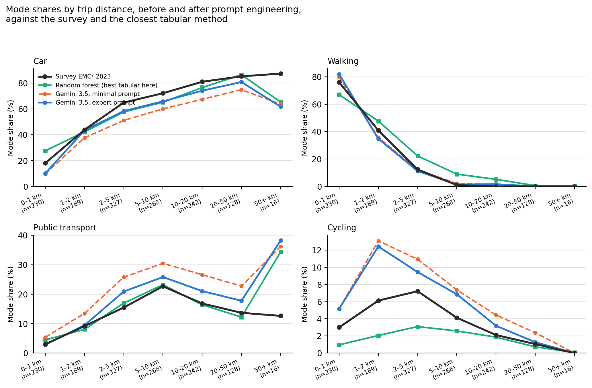
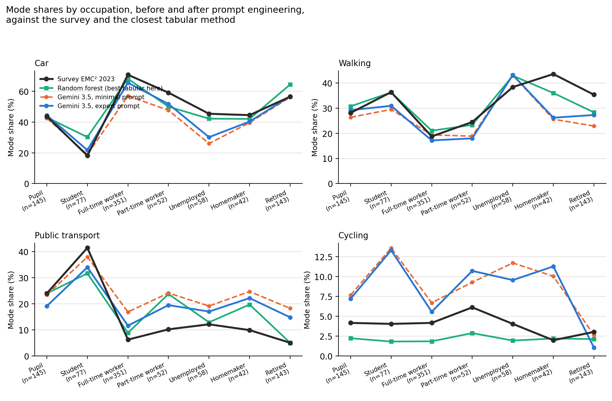
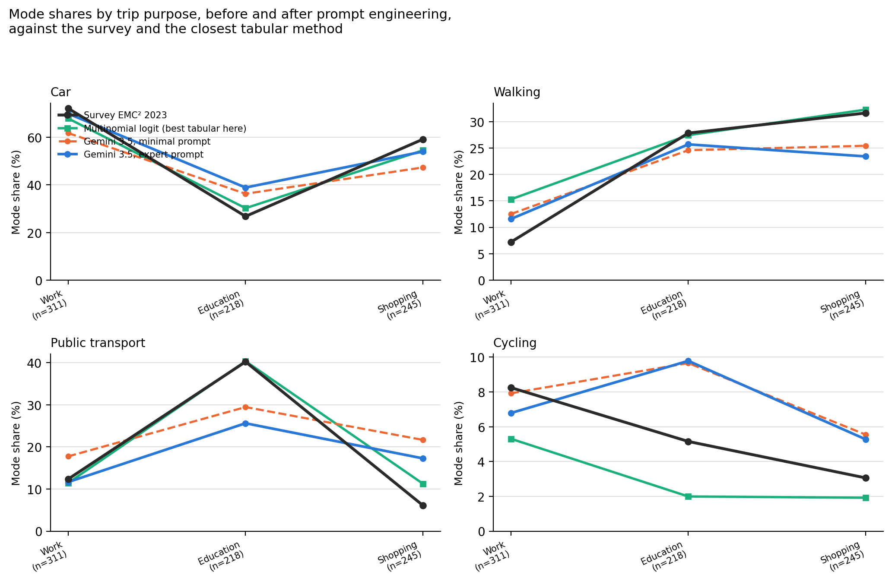

# Technical appendices (draft)

<!-- Dernière mise à jour : 2026-09-17 -->

**Document:** appendices of the AAMAS 2027 paper. English master; French mirror in [`fr/99_annexes.md`](../fr/99_annexes.md); LaTeX rendering for Overleaf in [`overleaf/99_annexes.tex`](../overleaf/99_annexes.tex).
**Status:** `draft v0` (17 September 2026) — first English master. Appendices A to G translate the French `brouillon v0`, itself extracted from `MANUSCRIT_DETAILLE_2026.md` `v1.6` (3 September 2026); appendix H translates the detailed results written on 17 September 2026 for chapter 6. The whole manuscript is frozen in [`../../archive/MANUSCRIT_DETAILLE_2026_v1.6.md`](../../archive/MANUSCRIT_DETAILLE_2026_v1.6.md).
**Three things to take up in appendices A to G before submission,** carried over from the French header and **not** repaired by the translation: the "Tier 1 / 2 / 3" vocabulary, replaced in the written chapters by *exploratory / robust / transferable*; the figures, to be cross-checked against their source in the repository rather than copied from here; and the section cross-references, which follow the old numbering of the manuscript. Appendix H does not carry these reservations: it is written on the corrected set and its figures carry their source.
**Place in the paper:** section of the same number in the plan announced in § 1.4 of [`../en/01_introduction.md`](../en/01_introduction.md). Progress: [`../README.md`](../README.md).

---

### Appendix A: API quota summary and the Antigravity platform

Inference rests on the SWRR API gateway (`llm_module`, 11 instances, 206 RPM / 37,700+ RPD) and on the Google Antigravity agentic environment (Gemini 3.6 Flash / 3.5 Flash Lite, 1M token context, isolated sub-agents).

### Appendix B: survey evaluation script (`eval_llm_on_survey.py`)

Blind inference script over $13\,045$ sealed trips of the EMC² 2023 survey.

### Appendix C: local inference configuration, Qwen-32B

vLLM server `Qwen/Qwen2.5-32B-Instruct-AWQ` at $\tau = 0.0$ with a fixed seed.

### Appendix D: calibration assessment and justification of the pivot

Non-convex loss landscape justifying the pivot towards the hybrid architecture.

### Appendix E: dictionary of the 21 variables of the evaluation contract

The parity contract of § 4.3 designates these 21 variables, and them alone. The list is fixed in the repository (`spec_version 2`) and it is that same file that builds the design matrix of the four tabular methods: neither the logit, nor gradient boosting, nor the random forest, nor the kernel regression sees anything else. <!-- source: scripts/progedo_logit/feature_spec.json -->

**Person and household — 12 variables**

| Variable | Type | What it says |
|---|---|---|
| `age` | numeric | age in completed years |
| `gender` | categorical | woman / man |
| `household_size` | numeric | number of people in the household |
| `has_driving_license` | boolean | the person holds a driving licence |
| `has_pt_subscription` | boolean | the person has a public transport pass |
| `number_of_cars` | numeric | cars of the household |
| `car_availability` | categorical | car available to all adults, to some, to none |
| `has_bike` | boolean | the person has a bicycle |
| `socioprofessional_class` | categorical | socio-professional category, 8 modalities |
| `main_occupation` | categorical | main occupation, 8 modalities |
| `employed` | boolean | the person holds a job |
| `studies` | boolean | the person is in education |

**Trip context — 3 variables**

| Variable | Type | What it says |
|---|---|---|
| `purpose` | categorical | purpose of the destination activity — home, work, education, shopping, leisure, other |
| `purpose_origin` | categorical | purpose of the origin activity, same modalities |
| `departure_hour` | numeric | departure time, in decimal hours |

**Geography — 6 variables**

| Variable | Type | What it says |
|---|---|---|
| `od_km` | numeric | straight-line origin–destination distance |
| `same_zone` | boolean | origin and destination in the same fine zone of the survey |
| `dist_center_orig_km` | numeric | distance from the origin to the inner centre |
| `dist_center_dest_km` | numeric | distance from the destination to the inner centre |
| `density_orig` | numeric | population density of the origin zone |
| `density_dest` | numeric | population density of the destination zone |

The inner centre is the centroid of the fine zones of the Capitole sector, and the distances are computed in the legal projection. A 19-variable variant, without the two distances to the inner centre, has been measured — accuracy **[xx]**, composite **[xx]** — and two alternative definitions of distance were set aside; the contract served is the 21-variable one.

What the agent receives **in addition** to these 21 variables — the agenda of its remaining trips, the weather of the coming time slots, the itineraries themselves — is described in § 4.3, and the wording of that asymmetry is not settled.

---

### Appendix F: log of methodological corrections (v1.4 → v1.6)

Every figure of the manuscript was cross-checked against the measurements the repository produces. Eleven gaps were corrected in this version:

| # | Gap found in `v1.3` | Correction applied in `v1.4` |
|---|---|---|
| 1 | "15 variables" at informational parity | Production contract at **21 variables** (`spec_version 2`) |
| 2 | L1 of the tabular reference ($2.68$) set against that of the LLM ($29.81$) | Probability mass vs argmax: comparison brought back to **$7.30$ against $29.81$** |
| 3 | "$\chi^2$, $p = 0.98$ confirms perfect fidelity" | Non-rejection is not proof; replaced by an **equivalence test** and effect sizes |
| 4 | Milestone 0 presented as a validation | Requalified as a **coherence check**; cross-tabulations still to test |
| 5 | Composites compared with no sample size | Sample size now mandatory: **$+5.02$ pt** measured at constant decisions when going from 881 to 81 people |
| 6 | Parity presented as symmetric | **Exposure asymmetry declared** ($31\,279$ trips seen against zero) and a few-shot condition added |
| 7 | "Tabular model blind to the event" | It is not blind, it is not informed → **condition 5** (tabular reference receiving the encoded event) |
| 8 | Press effect measured against a condition with no article | Addition of the **paraphrase with no modal cue** and **placebo article** conditions |
| 9 | "$10\,000\times$ faster" | **Withdrawn.** The ratio announced in `v1.4` ($\approx 2\,700\times$) came from the comparative table of the manuscript, not from a measurement in the repository: the cross-check of 15 September 2026 found no source. The figure is set aside pending measurement (chapter 9, point 1) |
| 10 | Perimeter of the unit audit ($1\,000$ vs $13\,045$ trips) | Perimeters made explicit: tabular references on $13\,045$, LLM on a subsample of $1\,000$ drawn from the same set |
| 11 | Composite weights announced at $0.40 / 0.20 / 0.20 / 0.20$ with $\sum w = 1$ | Weights actually served: global $1.0$ · absence $1.0$ · age $0.5$ · occupation $0.5$ · purpose $0.5$ · gender $0.3$ · distance $0.3$ — **weighted sum, not renormalised** |
| 12 *(v1.6)* | Demographic conformity table (§ 2.2): targets $51.8 / 19.4 / 62.1 / 18.5 / 22.3 / 46.1 / 31.6 / 84.2$ and cohort $51.9 / 19.2 / 62.4 / 18.4 / 22.1 / 46.5 / 31.4 / 84.0$ **with no source** — they match neither the AUAT report (5–17 year olds: 16 %; household car ownership: 19 / 45 / 35 %, p. 21), nor the measured reference population (16.2 % of 5–17 year olds, 13.0 % of personas with no car) | Targets replaced by those of the report (pp. 10, 11, 21) and, for the unpublished margins (sex, licence, immobile), by frozen recomputations on microdata; cohort = sealed population v3 measured by `scripts/AAMAS/control_population.py` (13 margins, TOST $\pm 1$ pt); conformity is declared **by construction** for the allocated margins |

*Cross-checking sources:* `scripts/progedo_logit/mode_choice_policy_metrics.json` (accuracy, LogLoss, confusion matrix, gain importances), `scripts/progedo_logit/feature_spec.json` (variable contract), `docs/arch/score-synthesis.md` (renormalisation over the offer, sample-size control, substrate guards), `docs/changelog.md` (terminal times per mode, measured distance variants).

---

### Appendix G: source of the survey data, citation and usage commitments

The tabular references of this paper — multinomial logit, LightGBM gradient boosting, kernel logistic regression and random forest — are fitted on the microdata of the Cerema-certified household travel survey of the greater Toulouse area (**EMC² 2023**), obtained from **Quetelet-Progedo-Diffusion** under agreement **`lil-1750`**.

**Citation of the source.** The template annexed to the agreement imposes this wording, to within one vintage:

> doi:10.13144/lil-0933
> Enquête Ménages Déplacements (EMD), Toulouse / Grande agglomération toulousaine
> (EMD, Toulouse / Grande agglomération toulousaine) - 2023, CEREMA, Syndicat mixte
> des transports en commun de l'agglomération toulousaine (producteurs), PROGEDO-ADISP
> (diffuseur)

The template as delivered carries "2013". The survey used in this work is that of **2023**, and it is the one the citation names: the vintage is corrected here, the rest of the wording is copied without change. The DOI remains the one the distributor assigned to the order.

Bibliographic entries: `tisseo2023emc2` for the published report, `progedo2023emc2microdata` for the distributed file.

**Obtaining the data.** The microdata are distributed to research through the Quetelet-Progedo-Diffusion portal (ADISP), `https://commande.progedo.fr/`. The record to request is the *Enquête Mobilité Certifiée Cerema (EMC²) de la Grande Agglomération Toulousaine, 2023* (Tisséo Collectivités, producer; Cerema, certification). The request is made online: account creation, selection of the survey in the catalogue, declaration of the research project, signature of the commitment recalled below. The agreement for this work carries the number `lil-1750`; a third party obtains their own, under their own number. No approach to the authors is necessary, and none replaces that one: the commitments forbid transfer.

**What the agreement commits to.** Research use only; no transfer of the data to a third party, in any form whatsoever; processing in accordance with the state of the art and with statistical confidentiality; registration of the research in the institution's processing declaration register; compliance with personal data regulation; mention of the source in communications and publications; information of the distributor about communications, quality findings and any reuse; storage in an encrypted space during the research; destruction of the files at its end. The full text of the commitments is copied into [`../../sources/ENGAGEMENT_DONNEES_EMC2.md`](../../sources/ENGAGEMENT_DONNEES_EMC2.md), which also keeps the log of the information sent to the distributor.

**Replaying the fit.** The files received are placed as they are under `data/PROGEDO 2023/`: the three standard files in `lil-1750-Donnees_CSV/fichiers_standards/Toulouse_2023_std_{pers,men,depl}.csv`, the fine-zone layer in `lil-1750-Documentation/SIG/EMC2_Toulouse_2023_ZF_26052023.shp`. `scripts/progedo_logit/build_mode_choice_dataset.py` then rebuilds the training set and its split: the split is made by household (`GroupShuffleSplit` on the household identifier, 25 %, seed 0), so that the 13,045 test trips come back identically, with no household straddling the two sides. The four methods are then refitted by `fit_mode_choice_{policy,logit,klr,forest}.py`, and the figures published in § 4.4 are recomputed from the `*_metrics.json` files produced.

**Consequence for the supplementary material.** The boundary runs there: the archive carries the code, the experiment configurations, the seeds and the sealed synthetic cohort v6 with its demographic control manifest, everything that can be audited with no procedure. It carries neither the microdata, nor the sealed test set of 13,045 trips, nor any file that would reproduce its content (§ 4.4).

**The same reading on drawn modes.** The runs of § 4.4, read on the mode drawn from the mass rather than on the mass itself, give the composite EMD–JSD below. The gap with the reading by mass measures the noise of the draw, and it does not go the same way for all of them: twenty-eight hundredths for gradient boosting, half a point for the logit, eight hundredths less for the kernel regression. The order of the four methods changes twice with respect to the mass: the random forest passes ahead of the logit it followed, and the kernel regression ahead of gradient boosting.

| Reference method | composite EMD–JSD, drawn modes |
|---|---:|
| Gradient boosting (LightGBM) | 3.88 (+0.28) |
| Multinomial logit | 4.54 (+0.52) |
| Kernel logistic regression | 3.52 (−0.08) |
| Random forest | 4.40 (+0.31) |

<!-- source: scores.json of the same runs as § 4.4, composite.emd_jsd_tire; the gap is given against composite.emd_jsd; corrected set of ticket 088, runs of 2026-09-16 -->

The itinerary offer submitted to the agents is not part of the archive either, for its size and not for its status: it regenerates from the cohort through the routing engines, and the manifest of the set seals the fingerprints that allow a check that the rebuilt set is the same one (population, GTFS feeds, OTP and OSMnx graphs, configuration files). A reviewer therefore checks the cohort, the protocol and the scores immediately, and the training side of the tabular references after a request to the distributor. The status of the resources derived from the survey — aggregate laws by ring, fine-zone divisions — is examined separately and is not settled to date.

**For the final version.** The mention of the processing declaration register, which names the institution, does not appear in the double-blind submitted version: it is to be added here at the time of the non-anonymous version, together with the acknowledgements to the distributor.

---

### Appendix H: detailed results of chapter 6

Chapter 6 publishes only the lessons; this appendix carries the complete tables they rest on. Substrate: cohort `population_1000_AAMAS_v6`, set `population_1000_AAMAS_v6_20260316_EN_c` (corrected set of [ticket 088](../../../tickets/ticket_088_jeu_corrige_et_rejeu_complet.md)), 3,154 scored decisions, 868 mobile people. Every decider is measured on it: the replay campaign finished on 2026-09-17 at 09:25, and no figure in this appendix is read off the earlier substrate.

#### H.1 The paired differences, on the three readings

Cluster resampling at the person level, 2,000 replicates, seed 2026, 868 people common to both sides. A positive gap is a higher error for the first term; in bold, the intervals that do not contain zero.

| Paired difference | Composite | Excluding single choice | L1 on global shares |
|---|---|---|---|
| `gemini-3.5` expert − minimal | **−2.27 [−3.22; −1.40]** | **−3.59 [−4.83; −2.45]** | **−10.2 [−12.5; −8.0]** |
| `gemini-3.1` expert − minimal | **−3.37 [−4.25; −2.45]** | **−4.15 [−5.22; −3.09]** | **−8.6 [−10.6; −6.8]** |
| `mistral-large` expert − minimal | **−7.25 [−8.67; −5.90]** | **−8.63 [−10.28; −7.15]** | **−18.0 [−22.4; −13.5]** |
| `gemini-3.5` expert − gradient boosting | **+1.35 [+0.28; +2.47]** | +1.09 [−0.27; +2.45] | +4.3 [−1.2; +9.7] |
| `gemini-3.5` expert − kernel regression | **+1.38 [+0.32; +2.45]** | **+1.35 [+0.10; +2.69]** | **+7.1 [+1.8; +12.1]** |
| `gemini-3.5` expert − random forest | +0.94 [−0.06; +1.98] | +1.17 [−0.02; +2.39] | **+7.7 [+3.3; +11.7]** |
| `gemini-3.5` expert − multinomial logit | +0.96 [−0.18; +2.17] | +0.39 [−1.10; +1.80] | +4.4 [−0.4; +8.5] |
| `gemini-3.1` expert − gradient boosting | **+5.50 [+4.19; +6.93]** | **+6.65 [+5.21; +8.29]** | **+21.7 [+16.6; +27.0]** |
| `mistral-large` expert − gradient boosting | **+4.07 [+2.47; +5.75]** | **+6.33 [+4.54; +8.09]** | **+17.2 [+12.7; +21.6]** |
| `gemini-3.1` − `gemini-3.5`, expert prompt | **+4.15 [+2.99; +5.43]** | **+5.56 [+4.12; +7.02]** | **+17.4 [+14.6; +20.3]** |
| `gemini-3.1` − `gemini-3.5`, minimal prompt | **+5.25 [+4.11; +6.40]** | **+6.13 [+4.75; +7.53]** | **+15.8 [+13.2; +18.3]** |
| `mistral-large` − `gemini-3.5`, expert prompt | **+2.71 [+1.17; +4.25]** | **+5.24 [+3.76; +6.66]** | **+12.8 [+8.3; +17.4]** |
| `gemini-3.1` − `mistral-large`, expert prompt | +1.44 [−0.10; +2.98] | +0.32 [−1.14; +1.82] | +4.6 [−0.1; +9.0] |
| `gemini-3.1` − `mistral-large`, minimal prompt | **−2.45 [−4.08; −0.85]** | **−4.16 [−5.89; −2.45]** | **−4.8 [−7.4; −2.2]** |

The ranking of the models changes with the instruction. Under the minimal prompt, `gemini-3.1` is ahead of `mistral-large` by 2.45 points, an interval excluding zero; under the expert prompt, `mistral-large` passes back ahead by 1.44, an interval containing zero. A benchmark run under a single instruction therefore measures the model–instruction couple, not the model.

The ablation of the justification clause, which asked the agent to explain why walking does not get the highest probability, is worth **+0.17 [−0.45; +0.79]** point on its removal: taking it out improves the composite, without the interval excluding zero. It is measured on the earlier substrate, the variant that carried it having been removed from the repository on 2026-09-17.

<!-- source: docs/traces/2026-09-17_09-40_ch6_jeu_corrige_complet/ — fourteen pairs, 2,000 replicates, seed 2026, 868 common people, every decider on the corrected set. The justification clause comes from docs/traces/2026-09-16_15-05_pe04_intervalles_apparies_manquants/ (pe05 − pe04). -->

#### H.2 The error by dimension and by decider

Mean of the stratum L1 errors, weighted by the size of the covered strata. The dimensions entering the composite are age, gender, occupation, purpose and distance; the residential ring and the housing type enter neither the composite nor the calibration cycle.

| Weighted L1 error (%) | distance | purpose | age | occupation | gender | ring | housing |
|---|---:|---:|---:|---:|---:|---:|---:|
| `gemini-3.5`, minimal prompt | 24.1 | 27.9 | 30.6 | 25.3 | 23.9 | 25.7 | 30.5 |
| `gemini-3.5`, expert prompt | **14.2** | 21.4 | 22.1 | 18.5 | 13.6 | 19.6 | 23.6 |
| `gemini-3.1`, minimal prompt | 38.0 | 37.8 | 43.9 | 39.2 | 39.4 | 40.5 | 43.1 |
| `gemini-3.1`, expert prompt | 30.2 | 30.8 | 35.8 | 31.2 | 30.7 | 33.0 | 37.4 |
| `mistral-large`, minimal prompt | 51.9 | 39.3 | 46.8 | 43.8 | 44.5 | 47.6 | 51.0 |
| `mistral-large`, expert prompt | 33.7 | 27.9 | 30.4 | 28.6 | 25.3 | 29.6 | 33.0 |
| Gradient boosting (LightGBM) | 17.8 | **13.6** | 18.2 | 15.7 | 8.5 | 11.5 | 16.6 |
| Random forest | 16.8 | 18.1 | **16.8** | **12.9** | **5.3** | **9.5** | **15.9** |

<!-- source: scores.json, detail.<dimension>.strates, mean of the stratum l1 weighted by n over the covered strata; every decider on the corrected set. In bold, the lowest error of each column: distance is the only one where an agent holds it. Figures regenerated by scripts/analysis/plot_chapitre6.py. -->

*Figure H.1 — The car share by stratum on six dimensions, before and after prompt engineering, against the survey target and the tabular method closest to that target on each dimension. The last two, residential ring and housing type, enter neither the composite nor the calibration cycle, and the gap stays wide there after tuning.*

*Figure H.2 — The four modes by distance band, one panel per mode. Car and walking land on the target from one kilometre onwards; public transport is overestimated by two to five points between two and twenty kilometres, and cycling by a factor of two on every band where it weighs. The tabular method errs the other way on cycling, which it places below the target everywhere.*

*Figure H.3 — The four modes read by occupation, same curves as Figure H.2. The two school-age strata, pupils and students, are those where the agent places cycling highest: 8.2 and 13.3 % under the expert prompt, against 4.2 and 4.0 % in the survey. Student public transport, for its part, goes from 37.9 to 35.5 % after tuning where the target is 41.4 %: tuning moves it away from the target on that stratum.*

*Figure H.4 — The four modes by trip purpose. Education is the purpose where the agent moves furthest from the target after tuning, and it moves away in the direction of the car: the lever of the cost of engaging a vehicle acts on a population that has none.*

#### H.3 The modal shares of each decider

| Share (%) | Car | Walking | Public transport | Cycling |
|---|---:|---:|---:|---:|
| EMC² 2023 survey | 56.7 | 26.8 | 12.4 | 4.1 |
| Minimal prompt, `gemini-3.5` | 47.4 | 24.0 | 20.9 | 7.6 |
| Expert prompt, `gemini-3.5` | 52.3 | 24.2 | 16.6 | 6.8 |
| Minimal prompt, `gemini-3.1` | 44.1 | 19.5 | 28.8 | 7.7 |
| Expert prompt, `gemini-3.1` | 46.2 | 21.7 | 24.8 | 7.4 |
| Minimal prompt, `mistral-large` | 36.7 | 24.4 | 30.6 | 8.2 |
| Expert prompt, `mistral-large` | 43.4 | 29.3 | 19.2 | 8.1 |
| Gradient boosting | 52.8 | 29.1 | 14.8 | 3.3 |
| Random forest | 56.2 | 27.6 | 14.2 | 2.0 |
| Kernel logistic regression | 54.4 | 28.9 | 13.6 | 3.0 |
| Multinomial logit | 53.3 | 27.2 | 16.4 | 3.0 |

Every decider underestimates the car, an effect of the chain constraint that weighs on all of them in the chained reading. The two families err in opposite directions on cycling: the three language models place it between 6.8 and 8.1 %, the four tabular methods between 2.0 and 3.3 %.

<!-- source: scores.json, global.actual and global.target -->

#### H.4 The strata that tuning degrades, on the three models

| Stratum L1 error (%) | minimal prompt | expert prompt |
|---|---:|---:|
| Education purpose, `gemini-3.5` (n = 218) | 28.0 | 33.5 |
| Education purpose, `gemini-3.1` (n = 218) | 20.0 | 21.2 |
| Education purpose, `mistral-large` (n = 218) | 8.7 | 22.3 |
| 15–19 year olds, `gemini-3.5` (n = 61) | 53.4 | 58.3 |
| 15–19 year olds, `gemini-3.1` (n = 61) | 49.2 | 47.9 |
| 15–19 year olds, `mistral-large` (n = 61) | 34.1 | 44.9 |

The degradation of the education purpose appears on all three models, that of the 15–19 year olds on `gemini-3.5` and `mistral-large`. Two strata otherwise resist every decider, tabular methods included: the 15–19 year olds, from 38 to 58 points of error, and trips over 50 kilometres, from 42 to 72 points over sixteen to nineteen decisions depending on the decider.

<!-- source: scores.json, detail.motif.strates and detail.age.strates -->

#### H.5 Decision-by-decision agreement, six pairs

Trips carrying at least two options offered to both deciders, 2,374 to 2,479 depending on the pair; every decider on the corrected set.

| Pair | Agreement, most likely mode | Agreement, drawn mode | Median L1 between distributions |
|---|---:|---:|---:|
| Gradient boosting / kernel regression | 91.6 % | 90.5 % | 8.3 |
| Gradient boosting / random forest | 89.0 % | 88.3 % | 11.3 |
| Expert prompt `gemini-3.5` / gradient boosting | 69.7 % | 61.4 % | 39.0 |
| Expert prompt `gemini-3.5` / random forest | 71.4 % | 60.4 % | 42.6 |
| Expert prompt `gemini-3.5` / expert prompt `gemini-3.1` | 79.6 % | 72.8 % | 40.0 |
| Expert prompt `gemini-3.1` / expert prompt `mistral-large` | 72.6 % | 70.6 % | 40.0 |

The median gap between the distributions of two agents is four times the one that separates two tabular methods.

<!-- source: moves.csv of the corrected-set runs, columns P(Marche/Vélo/Voiture Privée/Transports_collectifs) % and Mode de transport Choisi; recomputed on 2026-09-17 after the replay campaign ended. -->

#### H.6 The prompt variants and their scores

| Variant | Status | Composite | Excluding single choice | L1 on global shares |
|---|---|---:|---:|---:|
| `prompt_minimal_02` | no engineering | 7.02 | 10.39 | 24.08 |
| `prompt_expert_05` | tuned out of sample | 4.86 | 6.86 | 13.85 |
| `prompt_expert_06` | tuned in sight of the evaluated cohort | 5.33 | 7.24 | 15.39 |
| `prompt_expert_08` | tuned in sight of the evaluated cohort | 6.58 | 10.32 | 21.74 |

All on `gemini-3.5-flash-lite`. The two variants tuned in sight of the evaluated cohort were meant to give an upper bound, since they saw the residuals on which they are then judged; they do worse than the variant tuned out of sample. What the protocol foresaw as an in-sample fitting ceiling is therefore not reached by the prompts that had access to it.

<!-- source: data/experiences/exp_gemini-35-fl_{promin02,proexp05,proexp06,proexp08}_jtir_pop-1000_AAMAS_v6_jeu-20260316_EN_*t0_nosim; prompt_expert_07 declared, not played; prompt_expert_04 deleted from the repository on 2026-09-17. The optimisation procedure is described in § 5.3, its guard-rails in § 5.3.4. Order of magnitude of the search, declared by the author: a dozen iterations on gemini-3.5-flash-lite, two or three on each of the other two models. -->

---

### Tickets attached to this chapter
- [Ticket 053](../../../tickets/ticket_053_acces_donnees_recherche_et_reproductibilite.md) — Securing the reproducibility boundary and access to the research data (Quetelet-Progedo)
- [Ticket 062](../../../tickets/ticket_062_revue_et_alignement_des_annexes_techniques.md) — Review, completion and alignment of technical appendices A to G (chapter 99)
