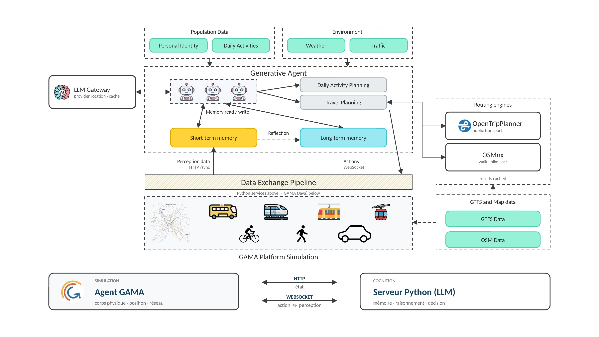
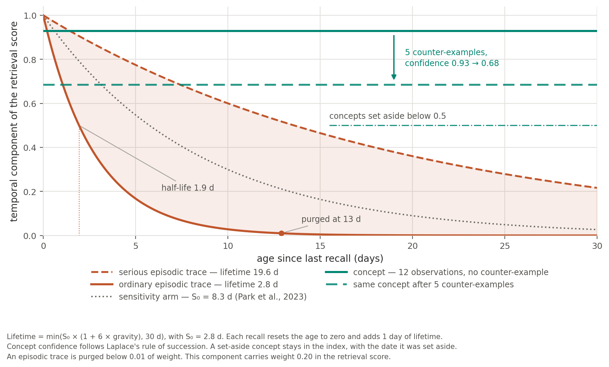

# 3. Architecture du dispositif agentique

<!-- Dernière mise à jour : 2026-09-17 -->

**Document :** chapitre 3 de l'article AAMAS 2027, **première rédaction en français** ; ce texte reste la source du chapitre. La version anglaise [`en/03_architecture.md`](../en/03_architecture.md) en est la traduction (`brouillon v0.7`, 17 septembre 2026) et les deux textes sont désormais tenus en parité. Le rendu LaTeX pour Overleaf est [`overleaf/03_architecture.tex`](../overleaf/03_architecture.tex) (`brouillon v0.7`, 17 septembre 2026).
**Statut :** `brouillon v0.7` (17 septembre 2026) — Figure 2 ajoutée au § 3.4 : la composante temporelle du score de rappel selon l'ancienneté, pour deux niveaux de gravité et pour un concept avant et après contre-exemples. La décroissance est désormais dite **depuis le dernier rappel**, ce que le texte laissait ouvert alors que la figure porte cette origine sur son axe.
**Statut antérieur :** `brouillon v0.6` (16 septembre 2026) — trois emprunts à une variante du chapitre proposee en relecture. La chaine de vehicules est notee $C_{i,t}$ et non plus $C_i$ : sa position change dans la journee, c'est l'objet du § 3.5. Un paragraphe du § 3.1 dit comment la causalite temporelle tient entre mille agents asynchrones, file par echeance croissante et retention de l'horloge GAMA. Le tirage du § 3.3 est ecrit en deux temps, le vecteur sur le simplexe puis le tirage categoriel. Ecartes de cette variante : le sextuplet $\mathcal{S}_{\text{MAS}}$, dont la moitie des symboles ne resservait jamais, et la phrase donnant les accidents pour tires d'une loi historique, le ticket 070 etant bloque et rien n'etant ecrit.
**Statut antérieur :** `brouillon v0.5` (15 septembre 2026) — ticket 050 appliqué : le quadruplet ⟨P, M, C, π⟩ au § 3.1, l'espace d'action et le tirage au § 3.3. Reprise de l'auteur le même jour, depuis le LaTeX : titre du chapitre et du § 3.2 changés, énumérations en deux-points, et trois passages resserrés ou retirés — la contrainte d'arrivée, le contrat de variables du § 3.3, la justification du plancher de consolidation. Le planning fixe est précisé (même chaîne tous les jours de semaine, week-end sans activité). Figure 1 ajoutée. Le § 3.4 **anticipe le ticket 071** : deux conditions de consolidation (ticket 048), registre épisodique contre registre sémantique, rappel à cinq termes, mémoire noyau — le texte est en avance sur le code, comme pour les accidents du ticket 070, et c'est l'intention. Retiré : le plafond de quinze minutes par ajustement au § 3.4, que le code fixe en réalité à une heure.
**Statut antérieur :** `brouillon v0.4` (11 septembre 2026) — reprises de l'auteur conservées ; quatre phrases reformulées (planning fixe, énumération des aléas, périmètre de l'enquête, attaque du paragraphe sur la sortie du modèle) et le contrat de variables réécrit en clair, la formulation antérieure étant incompréhensible.
**Statut antérieur :** `brouillon v0.3` (11 septembre 2026) — retour au style narratif de la `v0.1`, les corrections de la `v0.2` conservées. Deux ajouts issus d'une vérification dans le code : la formule « GAMA contraint la décision » était un raccourci — ce que GAMA produit, ce sont les conséquences, l'écart entre le trajet planifié et le trajet vécu ; et l'agent **ajuste ses horaires** quand il arrive en retard, ce que le chapitre passait sous silence.
**Statut antérieur :** `brouillon v0.2` (11 septembre 2026) — relecture de l'auteur, quatorze points. Retirés comme hors sujet à huit pages : le détail des appels aux moteurs, le fuseau horaire, le contrôle de rattachement au graphe, le car scolaire, les aménagements de la chaîne. Corrigés : un agent qui ne conduit pas peut être passager ; le modèle ne rend pas un indice mais une probabilité par option. · `brouillon v0.1` (11 septembre 2026) — première rédaction ; chapitre neuf, ni l'arbre `article/` ni le manuscrit figé `v1.6` ne décrivaient le dispositif évalué.
**Place dans l'article :** section 3 du plan annoncé en 1.4 de [`../en/01_introduction.md`](../en/01_introduction.md). État d'avancement : [`../README.md`](../README.md).
**Convention des tags :** un chiffre écrit **[xx.y | exp_id]** est un emplacement à remplir depuis l'export de [`../../methode/experience_plan/experiments.yaml`](../../methode/experience_plan/experiments.yaml). Un chiffre laissé en clair se recalcule depuis un fichier du dépôt ; sa source est donnée en commentaire HTML à côté.
**Sources d'architecture :** [`docs/arch/agents-lifecycle.md`](../../../arch/agents-lifecycle.md), [`routing.md`](../../../arch/routing.md), [`memory-stm-ltm.md`](../../../arch/memory-stm-ltm.md), [`vehicle-chain.md`](../../../arch/vehicle-chain.md).
---

## 3.1 Vue d'ensemble

Le dispositif couple trois composants. Une simulation multi-agents GAMA porte le monde : la géographie réelle de l'aire toulousaine, les réseaux, l'horloge, et l'exécution physique des déplacements. Un contrôleur porte le cycle de vie des agents : il détecte qu'un agent doit partir et construit l'offre d'itinéraires réellement disponible à cette heure-là. Un module de décision porte le choix lui-même : c'est là, et seulement là, qu'intervient le modèle de langue.

**Figure 1.** Architecture of the GAMA–generative agents coupling.

La boucle est fermée. Un agent immobile déclenche une planification ; il reçoit les itinéraires qui existent pour ce déplacement et répartit sa préférence entre eux ; sa décision part vers la simulation, qui exécute le trajet sur le réseau et renvoie ce qui s'est réellement passé : correspondances, attentes, heure d'arrivée. Ces retours alimentent la mémoire de l'agent, qui pèsera sur la décision suivante.

Mille agents décident de façon asynchrone pendant que l'horloge simulée avance. Le contrôleur sert donc les planifications par échéance croissante, l'échéance étant l'heure de départ simulée, et retient l'avancée de l'horloge GAMA quand le temps estimé pour vider la file menace une échéance. Aucun agent ne part sans avoir décidé, et aucune décision n'est prise après coup. <!-- source: docs/arch/agents-lifecycle.md, § file EDF (ticket 010) et § contre-pression prédictive ; world.predictive_backpressure_enabled = true -->

Formellement, un agent est un quadruplet $\text{Agent}_i = \langle P_i, M_{i,t}, C_{i,t}, \pi_\theta \rangle$ : $P_i$ le persona socio-démographique scellé, restreint au contrat de variables du § 3.3 ; $M_{i,t}$ le registre de mémoire à deux composantes à l'instant $t$, tampon circulaire d'observations récentes et index vectoriel long terme (§ 3.4) ; $C_{i,t}$ l'état à l'instant $t$ de la chaîne de véhicules du ménage (où sont la voiture et le vélo, qui détient le permis, § 3.5) ; et $\pi_\theta$ la politique de décision verbalisée par le modèle de langue $\theta$. Les trois premiers termes distinguent les agents entre eux ; le quatrième leur est commun, et c'est lui que le reste de l'article met à l'épreuve.

L'agent a un planning fixe : la même chaîne d'activités, dans le même ordre, tous les jours de semaine, refermée le soir sur le retour au domicile. Le week-end ne porte aucune activité, par simplicité. Il doit l'accomplir avec ce que la ville offre à cette heure, à cet endroit, et avec les véhicules dont il dispose. Ces bornes sont posées par le contrôleur, avant que la question ne soit posée au modèle. Ce que la simulation ajoute est d'une autre nature : elle produit les conséquences. Le trajet vécu n'est pas le trajet planifié ; un bus manqué, une correspondance ratée, un bouchon né d'un incident, un quart d'heure de retard sont des faits produits par l'exécution, et ce sont eux qui reviennent dans la boucle. C'est ce qui distingue le dispositif d'un classifieur interrogé hors sol, et ce qui rend le plancher et le plafond du chapitre 4 comparables à l'agent : tous trois décident sur le même substrat.

## 3.2 Les itinéraires proposés

Les itinéraires proposés à l'agent viennent de deux sources. OpenTripPlanner produit les itinéraires en transport collectif : bus, tram, métro, TER, cars interurbains, sur les horaires réels des réseaux. Un calcul de plus court chemin sur le graphe OpenStreetMap produit les trajets directs : marche, vélo, voiture. Le périmètre est celui de l'enquête de référence, l'EMC² 2023 du CEREMA : les 453 communes du bassin de vie toulousain. <!-- source: docs/arch/routing.md, § Vue d'ensemble -->

Tous les modes ne sont pas offerts à tous, et cette restriction s'opère avant la décision. La voiture et le vélo ne sont proposés que si l'agent les possède et qu'ils se trouvent au point de départ. Conduire demande en outre le permis et la majorité, mais un agent qui ne conduit pas peut voyager en voiture comme **passager** d'un ménage motorisé, et l'option lui reste ouverte à ce titre. <!-- source: docs/arch/routing.md, § Modes disponibles par agent ; docs/arch/vehicle-chain.md, § 1 bis -->

## 3.3 Le point de décision

Au moment de choisir, l'agent reçoit un profil court (prénom, âge, occupation, composition du ménage, niveau de revenu), la destination et sa zone, l'heure de départ, la météo du moment et celle des tranches restantes de la journée, les trajets qu'il lui reste à faire avant de rentrer, les souvenirs jugés pertinents pour ce déplacement, et enfin la liste numérotée des itinéraires, chacun avec son mode et le détail de ses étapes. Ce qu'il peut faire n'est pas un ensemble abstrait de modes : c'est l'ensemble fini des itinéraires viables à cet instant, $\mathcal{A}(o_t, C_{i,t}) \subseteq \mathcal{O}(o_t)$, où $\mathcal{O}(o_t)$ est ce que les deux moteurs du § 3.2 produisent pour l'observation $o_t$, et où l'inclusion devient stricte dès que l'éligibilité ou la position des véhicules $C_{i,t}$ retire une option (§ 3.5).

Le modèle de langue ne désigne pas un itinéraire : il **répartit une masse de probabilité sur les options**, une entrée par option, chacune avec sa justification. C'est la politique $\pi_\theta$ sur cette liste : elle produit un vecteur $\mathbf{p}_t = \pi_\theta(\cdot \mid o_t, M_{i,t})$ sur le simplexe des options viables, où $o_t$ est l'observation du déplacement. La décision est un tirage catégoriel dans ce vecteur, $a_t \sim \mathrm{Cat}(\mathbf{p}_t)$, de graine dérivée de ce même contexte, reproductible à l'identique, et jamais un $\arg\max$ : c'est ce qui sépare le dispositif d'un classifieur, et ce qui lui laisse son hétérogénéité individuelle. Les options lui sont présentées dans un ordre tiré au hasard pour que leur rang ne devienne pas une préférence. Ce détail décide de la nature de ce que nous mesurons : c'est une distribution que le modèle produit. <!-- source: mobility_llm/src/mobility_llm/mode_choice.py (draw_index, argmax_index) ; categories/itinary_multi_agent/output_schema.json -->

## 3.4 La mémoire

Sans mémoire, un agent redécide chaque matin à l'identique, et aucune dynamique n'est observable. Le dispositif en porte deux niveaux.

La mémoire courte est un tampon circulaire par agent, cent entrées au plus, partitionné par activité. Elle n'enregistre pas que des décisions : elle reçoit l'expérience physique que la simulation produit, c'est-à-dire les correspondances, les attentes à l'arrêt, les heures d'arrivée et les évènements de la journée. C'est par là que le vécu entre dans le raisonnement, et non par une description que l'agent se ferait de lui-même.

La consolidation se déclenche à deux conditions : dès que le tampon atteint dix entrées, et de toute façon une fois par jour simulé, en fin de soirée. <!-- source: settings.agent.stm_reflection_min_entries = 10 ; stm_reflection_daily_floor_hour = 22 -->

Elle verse dans la mémoire longue, un index vectoriel propre à chaque agent, où deux registres coexistent sans obéir à la même horloge. Les traces **épisodiques** (ce qui est arrivé, et quand) s'érodent : leur poids décroît exponentiellement depuis le dernier rappel, d'une constante de temps de 2,8 jours qu'un souvenir grave allonge sans jamais dépasser trente. Les **concepts** (ce que l'agent tient pour vrai, « cette ligne sature quand il pleut ») ne s'érodent pas : ils vivent sur une confiance que chaque observation confirme ou contredit, un fait ne devenant pas faux parce que dix jours ont passé. C'est la distinction de Tulving entre mémoire épisodique et mémoire sémantique, et c'est elle qui décide de ce qui s'oublie.

**Figure 2.** The temporal component of the retrieval score, by age since last recall. Episodic traces at two levels of gravity; a concept before and after five counter-examples.

Le rappel n'est pas une simple recherche de similarité : il combine cinq termes : proximité sémantique, gravité du souvenir, décroissance temporelle, appariement de la météo, affinité de lieu, de créneau et de motif, sur une fenêtre d'âge égale à l'horizon de l'expérience, soixante jours au plus. Et le modèle ne reçoit pas des souvenirs bruts. Il reçoit ce que l'agent en a agrégé : ce qu'il fait le plus souvent, ce qu'il tient pour vrai, ce qui vient de changer. Trois souvenirs choisis pour ce déplacement s'y ajoutent. <!-- source: docs/arch/memory-stm-ltm.md, partie III ; ticket 071 § 2.2 et § 2.4 -->

L'agent ne se contente pas de se souvenir qu'il est arrivé en retard : il en tire une conséquence. Une arrivée tardive avance sa cible horaire pour cette activité, de 75 % du retard constaté, sans jamais empiéter sur l'activité précédente ni sur la suivante. Le réajustement lui est écrit en mémoire à la première personne, si bien qu'il pourra le relire en décidant demain. C'est la forme la plus élémentaire d'apprentissage que porte le dispositif, et elle ne doit rien au modèle de langue : elle est produite par l'écart entre l'horaire prévu et l'horaire vécu. <!-- source: llm-agents/urban_mobility_agents/simulation_controller.py, reschedule_amount ; settings.agent.reschedule_transition_ratio = 0.75 -->

## 3.5 Modélisation par chaînes de déplacements

Un agent parti travailler à vélo n'a pas de voiture au bureau le soir. Cette évidence n'en est pas une pour un système qui déciderait chaque déplacement indépendamment, et c'est ce qui sépare le dispositif d'un classifieur appelé une fois par trajet.

Le contrôleur tient donc, pour chaque agent, la position de ses véhicules personnels, et il en tire trois règles : un mode véhiculé n'est proposé que si le véhicule est garé au point de départ ; le véhicule du mode retenu suit son utilisateur à destination, les autres restent où ils sont ; et sur un trajet de retour, si un véhicule attend au départ, les itinéraires candidats sont restreints à ce mode. Cette dernière règle filtre les options, elle n'ajoute pas de décision. <!-- source: docs/arch/vehicle-chain.md, § Les trois règles -->

Il faut en tirer la conséquence méthodologique, et le chapitre 6 y revient : une part de la répartition modale simulée est produite **sous** ces contraintes, pour être plus représentative des situations réelles. Un agent dont la voiture est restée au domicile ne choisit pas de ne pas conduire, il ne peut pas. C'est pourquoi le plancher et le plafond du chapitre 4 sont soumis exactement aux mêmes contraintes : sans cela, nous comparerions des décisions prises dans des mondes différents.

---

### Tickets associés à ce chapitre
- [Ticket 050](../../../tickets/ticket_050_formalisation_mathematique_agent.md) — Formalisation mathématique du dispositif agentique — **appliqué en v0.5** : quadruplet (§ 3.1), espace d'action et tirage (§ 3.3).
- [Ticket 051](../../../tickets/ticket_051_reflexion_architecture_cognitive_memoire.md) — Réflexion, audit épistémologique et refonte de l'architecture mémoire des agents
- [Ticket 070](../../../tickets/ticket_070_accidents_aleatoires_sur_les_axes.md) — Accidents tirés au sort sur les axes et retard subi : le mécanisme que promet « un bouchon né d'un incident » (§ 3.1)
- [Ticket 071](../../../tickets/ticket_071_evolution_memoire_du_code_actuel_a_l_etat_vise.md) — Évolution de la mémoire, du code actuel à l'état visé : le § 3.4 décrit cet état visé

### Dépendance ouverte
- [Ticket 046](../../../tickets/ticket_046_asymetrie_informationnelle_du_contrat_d_evaluation.md) — **asymétrie informationnelle du contrat d'évaluation.** Le paragraphe du § 3.3 qui affirmait que l'agent et les modèles statistiques « voient la même chose » a été retiré le 15 septembre 2026. Le chapitre 3 ne porte donc plus cette affirmation : elle reste à traiter là où le contrat d'évaluation est énoncé, au chapitre 4.
