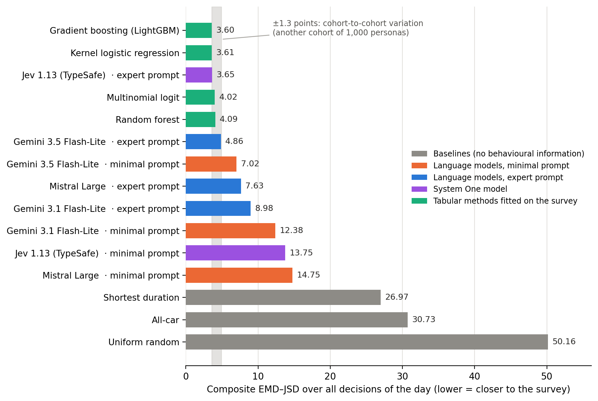
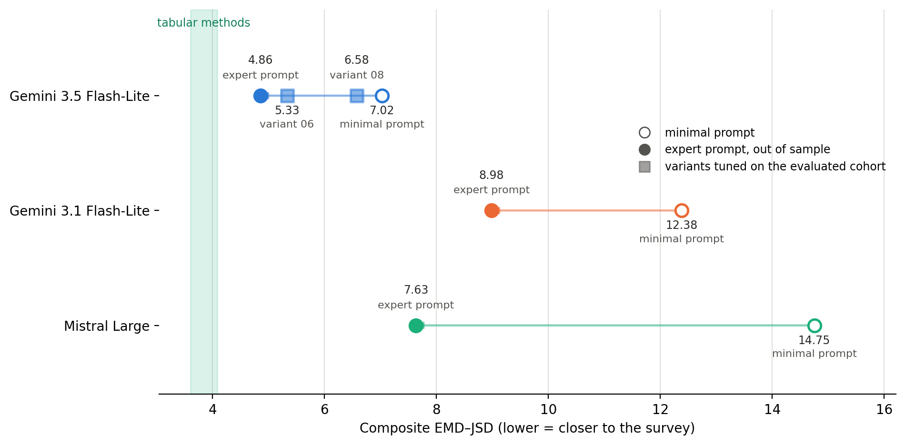
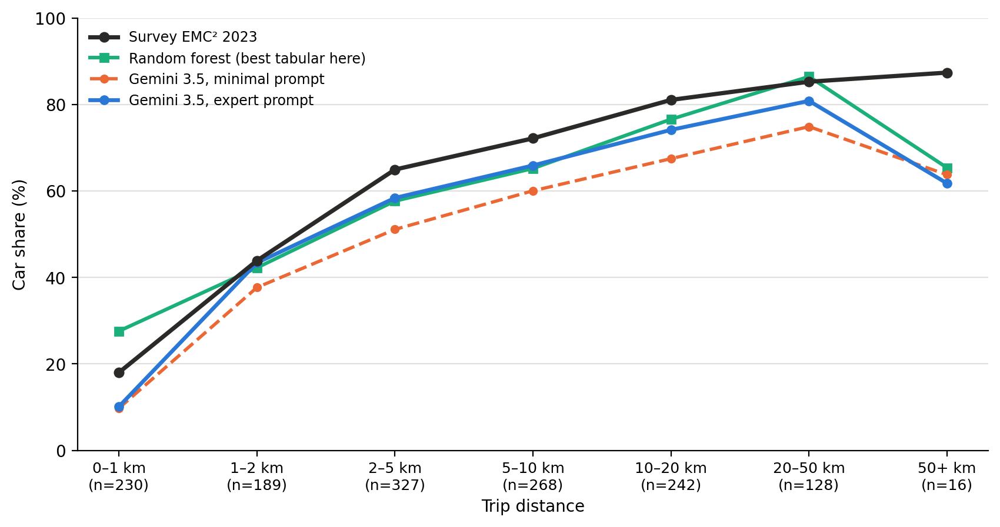
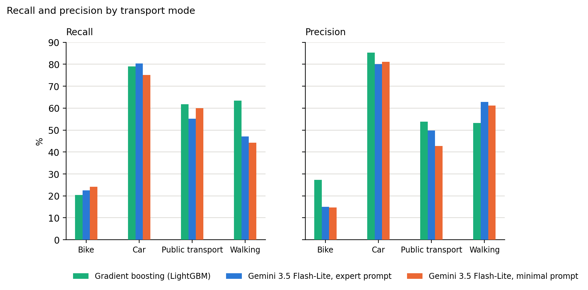
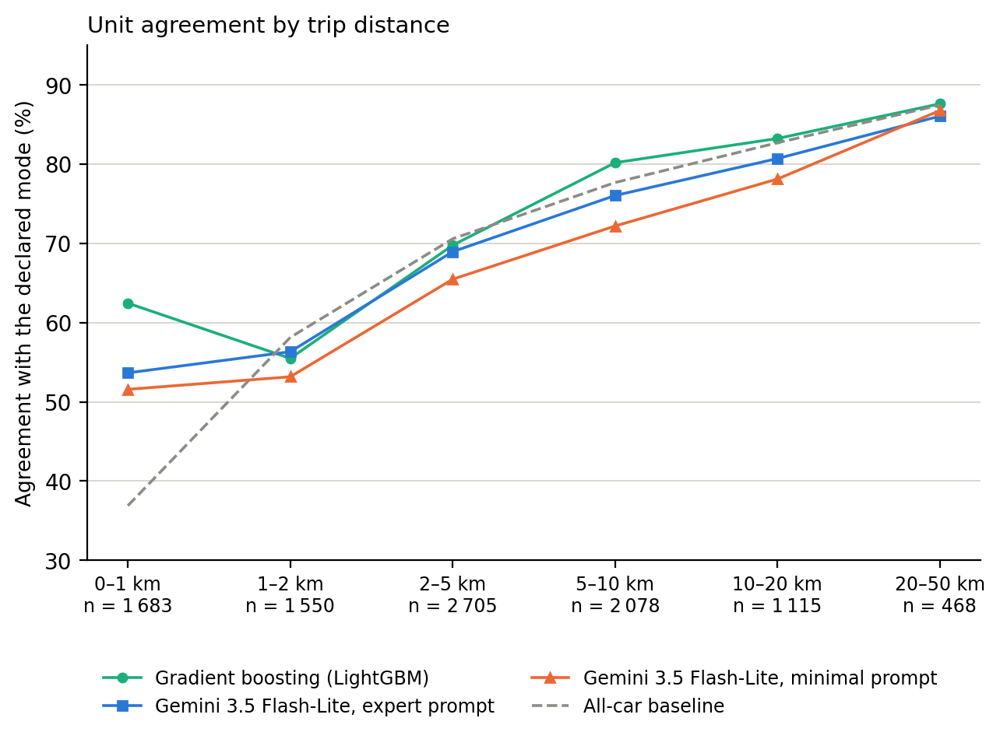

# 6. Résultats

<!-- Dernière mise à jour : 2026-09-17 -->

**Document :** chapitre 6 de l'article AAMAS 2027 — le chapitre de **résultats** : le chapitre 5 définit les conditions comparées, celui-ci dit ce que la comparaison établit.
**Statut :** `brouillon v0.8` (21 septembre 2026) — l'entropie croisée du § 6.5 change de valeur et de conclusion. Chaque décideur y était noté sur les seules décisions où sa distribution laissait une masse non nulle au mode déclaré, c'est-à-dire sur un ensemble qu'il se choisissait en tranchant plus ou moins dur, de 5 923 à 6 588 décisions. Sur le support commun aux six décideurs comparés, 5 451 décisions, le prompt expert ne devance plus que le logit multinomial là où il passait devant les quatre méthodes tabulaires. Le tableau, sa légende et le paragraphe suivent ; l'annexe I et le § 4.2 aussi. Mesure refaite par `scripts/progedo_logit/audit_unitaire_058.py`, corrigé le même jour.
**Statut antérieur :** `brouillon v0.7` (21 septembre 2026) — le paragraphe de lecture du § 6.5 est réécrit, à la demande de l'auteur : il n'était pas compréhensible. Il disait « grandeur lue » et « masse » sans les gloser et repartait vers le § 6.1 sans transition. Il dit maintenant le résultat, l'agent se trompe de mode aussi souvent que les méthodes tabulaires mais accordait davantage de probabilité au mode déclaré quand il se trompe, et laisse les valeurs au tableau qui le précède. L'incise sur la cohorte synthétique sort du paragraphe d'ouverture. `brouillon v0.6` (21 septembre 2026) — passage du chapitre au crible des trois règles du [README](README.md), à la demande de l'auteur. Sortent en règle 1, la maxime qui ouvrait le § 6.4 et l'annonce négative de la figure 6.6 ; le § 6.5 commence par ce qu'il mesure au lieu de ce que la cohorte n'a pas. Sortent en règle 2, le réglage déclaré et le compte d'itérations du § 6.2, qui descendent en commentaire, la généralité du § 6.5 sur la moitié des individus, que le tableau contredit à 67,6 % d'exactitude, et le paragraphe des deux asymétries, que le chapitre 8 porte. La légende de la figure 6.1 passe de sept phrases à quatre sans perdre de constat. La prose tombe de 1 439 à 1 277 mots. Aucun chiffre ne bouge. Corrigé au passage : le § 6.6 renvoyait encore aux différences appariées du § 6.1, qui n'en porte plus. `brouillon v0.5` (21 septembre 2026) — le chapitre est resserré une seconde fois, sur demande de l'auteur : le chapeau perd son rappel du chapitre 5, les trois paragraphes sous le tableau du § 6.1 sortent, et le § 6.3 est ramené à ce que ses deux figures établissent. L'audit unitaire quitte le § 6.4 et tient une section à lui, le **§ 6.5**, la variation de cohorte devenant le § 6.6. Six sections, six figures en anglais, inchangées. Aucun chiffre ne bouge. L'estimation appariée qui rapportait H0 sort du chapitre avec le § 6.1 ; le § 1.3 et le résumé y renvoient encore. `brouillon v0.4` (17 septembre 2026) — le chapitre est resserré sur les enseignements, sur demande de l'auteur : les tableaux de détail, les strates une à une et les écarts secondaires partent à l'**annexe H**, que ce chapitre cite. Cinq sections, six figures en anglais : quatre régénérées par `scripts/analysis/plot_chapitre6.py`, les deux de l'audit unitaire par `scripts/analysis/plot_audit_unitaire.py`. La section qui portait l'écart au plafond tabulaire disparaît : cet écart se lit désormais sous le tableau du § 6.1, et la variation de cohorte tient une section à elle. `brouillon v0.3` (17 septembre 2026) — réorganisation en cinq sections autour du couple modèle-consigne, vocabulaire aligné sur le dépôt (décideur, prompt minimal, prompt expert), coût d'exécution déplacé au chapitre 9. `brouillon v0.2` (16 septembre 2026) — réécriture sur les scores recalculés depuis le dépôt. `projet v0.1` (15 septembre 2026) — première rédaction au titre du [ticket 080](../../../tickets/ticket_080_idee_directrice_du_chapitre_6_et_impact_sur_le_papier.md).
**Place dans l'article :** section 6 du plan annoncé en 1.4 de [`../en/01_introduction.md`](../en/01_introduction.md). Trame : [`../plan/PLAN.md`](../plan/PLAN.md). État d'avancement : [`../README.md`](../README.md).
**Convention :** un chiffre suivi de **TBD** est à consolider. Un chiffre **en gras entre crochets** est un emplacement vide.

---

<!-- source: data/experiences/exp_*_jtir_pop-1000_AAMAS_v6_jeu-20260316_EN_c_*/executions/*/scores.json ; cohorte population_1000_AAMAS_v6, jeu population_1000_AAMAS_v6_20260316_EN_c, formule v1_reference (0aeee565…), référentiel EMC² 2023 (9ac34597…). 3 154 décisions sur 3 299 attendues, 868 personnes mobiles ; 138 déplacements inexploitables sont exclus par le scoreur. Tous les décideurs sont mesurés sur ce jeu : la campagne de rejeu du ticket 088 s'est terminée le 2026-09-17 à 09:25, et plus aucun chiffre du chapitre n'est lu sur le substrat antérieur. -->

Chaque résultat de ce chapitre porte sur un couple : un modèle de langue et une consigne d'arbitrage, portée par son prompt système. L'ingénierie de ce prompt rapproche `gemini-3.5-flash-lite` de 2,3 points de composite de la distribution d'enquête et `mistral-large-2512` de 7,3, quand la variation de cohorte est de l'ordre de 1,3 point. Le porteur pèse autant que la consigne : soumise telle quelle à un second modèle du même fournisseur, la variante réglée contre `gemini-3.5-flash-lite` laisse 4,2 points d'écart entre les deux, davantage que ce qu'elle apporte au moins bon d'entre eux. Des trois couples mesurés, un seul vient à un point et demi du plafond tabulaire, séparable de deux des quatre méthodes de référence.

## 6.1 Treize décideurs sur la même échelle

Les trois lectures définies au § 4.2 sont publiées pour chaque décideur.

*Figure 6.1 — Les treize décideurs sur l'axe du composite EMD–JSD, un facteur quatorze entre le plancher aléatoire et le meilleur composite. Quatre groupes s'y séparent : les planchers de 27 à 50, le prompt minimal de 7,0 à 14,8, le prompt expert de 4,9 à 9,0, les quatre méthodes tabulaires de 3,60 à 4,09. Le prompt minimal passe donc sous l'heuristique de durée minimale, à 27,0 : les faits seuls, sans consigne d'arbitrage, portent déjà une information comportementale. La bande grise donne la variation de cohorte, de l'ordre de 1,3 point.*

| Décideur | Composite EMD–JSD | Hors choix unique | L1 parts globales |
|---|---:|---:|---:|
| Hasard uniforme | 50,16 | 57,90 | 86,80 |
| Tout-voiture | 30,73 | 28,41 | 58,00 |
| Durée minimale | 26,97 | 23,93 | 53,62 |
| Prompt minimal, `mistral-large-2512` | 14,75 | 20,72 | 44,71 |
| Prompt minimal, `gemini-3.1-flash-lite` | 12,38 | 16,65 | 39,88 |
| Prompt minimal, `gemini-3.5-flash-lite` | 7,02 | 10,39 | 24,08 |
| Prompt expert, `gemini-3.1-flash-lite` | 8,98 | 12,39 | 31,25 |
| Prompt expert, `mistral-large-2512` | 7,63 | 12,27 | 26,64 |
| Prompt expert, `gemini-3.5-flash-lite` | 4,86 | 6,86 | 13,85 |
| Logit multinomial | 4,02 | 6,63 | 8,99 |
| Forêt aléatoire | 4,09 | 5,81 | **5,28** |
| Régression logistique à noyau | 3,61 | **5,61** | 6,69 |
| Gradient boosté (LightGBM) | **3,60** | 5,84 | 9,49 |

<!-- sources: scores.json, composite.emd_jsd, composite.emd_jsd_hors_choix_unique, global.l1. Prompt minimal = prompt_minimal_02 ; prompt expert = prompt_expert_05, promu le 2026-09-17 (prompt_expert_04 supprimé du dépôt le même jour, à la demande de l'auteur). Dans cette campagne, prompt_expert_05 a été réglé contre gemini-3.5-flash-lite puis soumis tel quel aux deux autres modèles ; rien dans le protocole n'impose une consigne unique, et un réglage par modèle reste ouvert. En gras, le meilleur score de chaque colonne. -->

<!-- source: docs/traces/2026-09-17_09-40_ch6_jeu_corrige_complet/ — quatorze différences appariées recalculées après la fin de la campagne de rejeu, tous les décideurs sur le jeu corrigé, 2 000 réplicats, graine 2026, rééchantillonnage par grappe au niveau de la personne sur 868 personnes communes. Les quatorze différences et leurs trois lectures sont à l'annexe H. -->

## 6.2 Ce que l'ingénierie de prompt déplace

*Figure 6.2 — Ce que l'ingénierie de prompt fait parcourir à chaque modèle. Le cercle creux est le prompt minimal, le cercle plein le prompt expert de référence, les carrés deux variantes réécrites sur les résidus de la cohorte. La bande verte donne l'intervalle des quatre méthodes tabulaires. Les trois modèles partent d'endroits différents, avancent de montants différents, et un seul entre au contact de la bande.*

| Gain apparié, prompt expert − prompt minimal | Composite | Hors choix unique | L1 parts globales |
|---|---|---|---|
| `gemini-3.5-flash-lite` | **+2,27 [+1,40 ; +3,22]** | **+3,59 [+2,45 ; +4,83]** | **+10,2 [+8,0 ; +12,5]** |
| `gemini-3.1-flash-lite` | **+3,37 [+2,45 ; +4,25]** | **+4,15 [+3,09 ; +5,22]** | **+8,6 [+6,8 ; +10,6]** |
| `mistral-large-2512` | **+7,25 [+5,90 ; +8,67]** | **+8,63 [+7,15 ; +10,28]** | **+18,0 [+13,5 ; +22,4]** |

Ces déplacements sont mesurés à personas, offre d'itinéraires, graine et modèle de fondation identiques, la consigne seule changeant. Les trois intervalles excluent zéro sur les trois lectures, et le gain va de une fois et demie à cinq fois et demie la variation de cohorte.

<!-- source: docs/traces/2026-09-17_09-40_ch6_jeu_corrige_complet/ ; 2 000 réplicats, graine 2026, 868 personnes communes, tous les décideurs sur le jeu corrigé. Un gain positif est une erreur plus faible. Une douzaine d'itérations d'ingénierie sur gemini-3.5-flash-lite et deux ou trois sur chacun des deux autres modèles, ordre de grandeur déclaré par l'auteur ; la variante mesurée a été réglée contre gemini-3.5 ; le § 5.2 décrit la procédure, l'annexe H porte les variantes et leurs scores. Les écarts entre porteurs sous chaque consigne, le renversement de classement entre gemini-3.1 et mistral-large, et l'ablation de la clause de justification sont à l'annexe H. -->

## 6.3 Le détail des résultats agrégés, sur Gemini 3.5

*Figure 6.3 — La part de la voiture par tranche de distance : la cible d'enquête, `gemini-3.5` sous prompt minimal puis sous prompt expert, et la méthode tabulaire la plus proche de la cible sur cette dimension.*

<!-- source: scores.json des deux exécutions du jeu corrigé, detail.distance.strates, part voiture prompt_minimal_02 → prompt_expert_05 : 9,7 → 10,1 (0-1 km) ; 37,7 → 43,4 ; 51,1 → 58,4 ; 60,0 → 65,9 ; 67,5 → 74,1 ; 74,9 → 80,8 ; 63,8 → 61,8 (plus de 50 km, n = 17). Le levier de coût fixe du véhicule (« Fixed frictions of the car ») appartient à prompt_expert_08, pas à prompt_expert_05 que la figure trace : la pente est mesurée, son attribution à ce levier ne l'est pas. -->

*Figure 6.4 — Les deux modes qui portent le résidu, lus par âge et par occupation. Le pic de transports collectifs des 15–19 ans, 47,4 % dans l'enquête, n'est reproduit par aucun décideur : l'agent en place 20,8 % après réglage et la forêt aléatoire 26,4 %. Le vélo suit le chemin inverse sur la même strate, 19,7 % chez l'agent contre 4,1 % observés, et le réglage ne le déplace pas.*

Les deux modes minoritaires portent une erreur que la consigne ne corrige pas. Les trois modèles de langue placent le vélo entre 6,8 et 8,1 % quand l'enquête en compte 4,1 %, et l'ingénierie de prompt ne déplace cette part que de un dixième à huit dixièmes de point, là où elle fait reculer les transports collectifs de quatre à onze points : deux erreurs coexistent dans le même décideur, et une seule répond à la consigne.

Les résultats détaillés sont à l'[annexe H](99_annexes.md) : l'erreur par dimension et par décideur, les parts modales de chacun, les strates que le réglage dégrade sur les trois modèles, et quatre planches, la part voiture sur six dimensions et les quatre modes lus par distance, par occupation et par motif.

<!-- source: scores.json, detail.<dimension>.strates et global.actual/target ; tous les décideurs sur le jeu corrigé …_20260316_EN_c. La figure compare prompt_minimal_02 et prompt_expert_05, régénérée le 2026-09-17 par scripts/analysis/plot_chapitre6.py. Erreur L1 pondérée sur la dimension distance, moyenne des strates couvertes pondérée par leur effectif : 14,19 pour gemini-3.5 sous prompt expert, 16,79 à la forêt aléatoire, 17,79 au gradient boosté, 18,09 à la régression à noyau, 20,73 au logit multinomial. Les 15-19 ans et les déplacements de plus de 50 km résistent à tous les décideurs, méthodes tabulaires comprises : 34 à 59 et 42 à 72 points d'erreur. Annexe H. -->

## 6.4 L'accord entre décideurs, déplacement par déplacement

À offre égale, sur les déplacements où les deux décideurs ont réellement choisi, l'accord se mesure sur le mode le plus probable et sur le mode effectivement tiré.

| Paire | Accord, mode le plus probable | Accord, mode tiré |
|---|---:|---:|
| Gradient boosté / régression à noyau | 91,6 % | 90,5 % |
| Prompt expert `gemini-3.5` / gradient boosté | 69,7 % | 61,4 % |
| Prompt expert `gemini-3.5` / prompt expert `gemini-3.1` | 79,6 % | 72,8 % |

Les quatre méthodes tabulaires forment un bloc, à neuf accords sur dix. Aucun agent n'y entre, et les agents n'en forment pas un second : les deux modèles de langue comparés ici s'accordent aussi peu entre eux qu'avec une méthode tabulaire. Un déplacement sur trois reçoit deux réponses différentes de deux décideurs que les parts agrégées donnent pour voisins.

<!-- source: moves.csv des exécutions du jeu corrigé, déplacements portant au moins deux options offertes aux deux décideurs, 2 374 à 2 479 selon la paire ; les six paires et l'écart médian entre distributions sont à l'annexe H. -->

## 6.5 Décision individuelle

L'exactitude unitaire annoncée au § 4.2 se mesure sur les journées réellement décrites par les enquêtés, selon le protocole du § 5.4 : 9 621 déplacements de 2 930 personnes, chacun portant le mode qu'elles ont déclaré.

| Décideur | Exactitude | Entropie croisée | Rappel vélo | Rappel marche |
|---|---:|---:|---:|---:|
| Gradient boosté | 71,5 | **0,299** | 20,4 | 63,4 |
| Logit multinomial | 68,6 | 0,358 | 18,3 | 60,0 |
| Durée minimale | 68,1 | — | 25,8 | 19,2 |
| Prompt expert `gemini-3.5` | 67,6 | 0,342 | 22,5 | 47,2 |
| Prompt minimal `gemini-3.5` | 64,8 | 0,383 | 24,1 | 44,2 |

*Cinq décideurs sur neuf, en pourcentage sauf l'entropie croisée, mesurée sur les 5 451 décisions que tous les décideurs comparés notent. Les quatre autres et les colonnes de précision sont à l'annexe I.*

Le prompt expert désigne le mode déclaré un peu moins souvent que les méthodes tabulaires. Sur l'entropie croisée, qui pèse la probabilité qu'un décideur accordait au mode finalement déclaré, il n'en devance qu'une, le logit multinomial. Le classement dépend donc de la grandeur lue sans amener l'agent devant, et aucune de ces deux lectures ne se lit sur le composite du § 6.1, qui ne compare que des parts agrégées.

*Figure 6.5 — Rappel et précision par mode, pour le plafond tabulaire et les deux paliers. Les deux paliers rappellent le vélo mieux que toute méthode ajustée, 22,5 et 24,1 % contre 20,4, et le paient en précision, 15,0 contre 27,3 : ils annoncent le vélo trois fois trop souvent. Sur la marche le rapport s'inverse, rappel 47,2 contre 63,4 et précision 62,9 contre 53,2, la meilleure du tableau.*

*Figure 6.6 — L'accord unitaire par tranche de distance. Sous 1 km, un tiers de l'échantillon avec la tranche suivante, les décideurs s'étalent de 36,9 à 62,4 % ; au-delà de 10 km ils tiennent tous en deux points et le plancher tout-voiture rejoint le plafond tabulaire. La comparaison entre décideurs se joue sur les courtes distances.*

Le détail par mode des neuf décideurs, la matrice de confusion et le plafond de l'audit sont à l'annexe I.

<!-- sources: entropie croisée recalculée le 2026-09-21 sur le support commun, les 5 451 décisions arbitrées que notent les six décideurs à distribution comparés ici ; la lecture antérieure notait chaque décideur sur son propre sous-ensemble, de 5 923 à 6 588 décisions selon qu'il tranchait plus ou moins dur, et donnait le prompt expert premier — trace docs/traces/2026-09-21_11-45_ticket058_entropie_support_commun/. Exactitudes unitaires, scripts/progedo_logit/audit_unitaire_058.py sur les exécutions du jeu enquete_058_test_20260316, neuf décideurs, 9 613 à 9 618 déplacements notés selon le décideur ; figures 6.5 et 6.6 régénérées par scripts/analysis/plot_audit_unitaire.py (9 621 déclarés, moins ceux sans offre et les enchaînements rompus). Les deux bras LLM sont exp_gemini-35-fl_{promin02,proexp05}_jtir_pop-enquete_058_test_… terminés les 2026-09-18 et 2026-09-19, 12 562 décisions chacun, aucune erreur. Ces valeurs ne sont commensurables ni avec les composites (jeu différent, support différent) ni avec les repères de la partition de test cités au § 5.3 : ceux-ci valent hors contrainte de chaîne et sans plafond d'options, et donnent 76,6 à 78,5 % aux mêmes méthodes tabulaires qui font ici 68,6 à 71,5 %. -->

## 6.6 Variation de cohorte et dispersion entre graines

Une cohorte de 1 000 personas ne mesure un composite qu'à ±1,3 point près : c'est l'intervalle de confiance à 95 % obtenu en rééchantillonnant les personnes avec remise, et il borne ce que le tableau du § 6.1 permet de départager. L'écart-type apparié de ce terme vaut ≈ 0,7, de sorte qu'aucune marge d'équivalence inférieure à 1,4 point ne se conclura d'un run sur cette cohorte ; seules des cohortes supplémentaires l'abaissent. C'est la raison pour laquelle toutes les comparaisons de ce chapitre sont appariées : jouer les deux décideurs sur les mêmes personas fait agir ce terme des deux côtés, où il s'annule.

La dispersion entre graines, elle, laisse les écarts de ce chapitre où ils sont **TBC**. Rejoué sur la même cohorte avec d'autres graines, un décideur à modèle de langue reste dans la variation de cohorte, et aucune des différences appariées du § 6.2 et de l'annexe H n'y change de signe **TBC**.

<!-- Les deux affirmations du paragraphe ci-dessus anticipent un résultat qui n'est PAS mesuré, d'où le **TBC**. Décision de l'auteur du 2026-09-17 : écrire le chapitre en tenant la dispersion entre graines pour acquise et semblable, et lever le TBC quand le rejeu à l'identique de l'axe 1 du ticket 073 l'aura établi. Aucun chiffre n'est avancé tant que la mesure n'existe pas. Ne pas publier ce paragraphe sans ce rejeu. -->

Deux mesures en donnent déjà l'ordre de grandeur. Le même prompt, sur le même modèle et avec la même graine, rejoué sur un substrat corrigé, déplace son composite de 0,24 à 1,17 point selon le décideur, quand les décideurs déterministes bougent de moins de 0,12 ; et deux exécutions du même prompt sur deux cohortes successives s'accordent sur 86,1 % des modes les plus probables. L'une et l'autre confondent le non-déterminisme du modèle avec le changement de substrat, et c'est le rejeu à l'identique qui les sépare.

<!-- ATTENTION RELECTURE : les deux **TBC** du deuxième paragraphe anticipent un résultat qui n'est pas encore mesuré. Décision de l'auteur du 2026-09-17 : écrire le chapitre en considérant la dispersion inter-graines comme acquise et similaire, et lever les TBC quand le ticket 073 axe 1 aura rendu son rejeu à l'identique. Aucun chiffre n'est avancé tant que la mesure n'existe pas. Le reste est mesuré : ±1,3 point et écart-type apparié de 0,7 du ticket 080 § 0.3, écarts de substrat lus dans les scores.json des deux jeux, accord de 86,1 % issu de deux exécutions du même prompt sur deux cohortes successives. -->

---

### Tickets associés à ce chapitre

- [Ticket 080](../../../tickets/ticket_080_idee_directrice_du_chapitre_6_et_impact_sur_le_papier.md) — idée directrice, décisions de l'auteur, impact sur le reste du papier
- [Ticket 088](../../../tickets/ticket_088_jeu_corrige_et_rejeu_complet.md) — jeu corrigé et rejeu des décideurs à modèle de langue
- [Ticket 073](../../../tickets/ticket_073_reproductibilite_prompt_calibre_multi_graines_multi_populations.md) — rejeu à l'identique, dispersion inter-graines, cohortes supplémentaires
- [Ticket 074](../../../tickets/ticket_074_bascule_anglaise_archivage_et_reprise_de_campagne.md) — campagne v6, substrat des chiffres publiés
- [Ticket 055](../../../tickets/ticket_055_benchmark_multimodeles_et_variabilite.md) — banc d'essai multi-modèles
- [Ticket 057](../../../tickets/ticket_057_audit_et_reflexion_double_lecture_tabulaire.md) — contrainte de chaîne des véhicules et périmètre de score
- [Ticket 058](../../../tickets/ticket_058_perimetre_et_methode_audit_unitaire.md) — audit unitaire, accord aux choix observés, attributions de Shapley
- [Ticket 046](../../../tickets/ticket_046_asymetrie_informationnelle_du_contrat_d_evaluation.md) — asymétrie d'information entre l'agent et les méthodes tabulaires
- [Ticket 081](../../../tickets/ticket_081_garde_fou_du_scoreur_sur_journal_tronque.md) — garde-fou du scoreur sur journal tronqué
