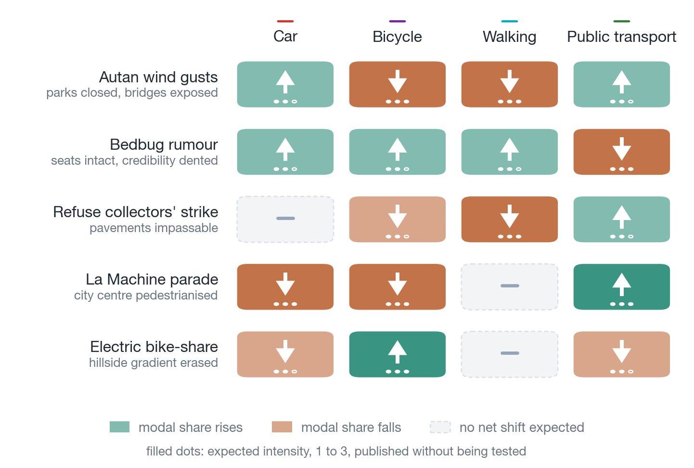

# 7. Adaptation des agents aux chocs externes

<!-- Dernière mise à jour : 2026-09-22 -->

**Document :** chapitre 7 de l'article AAMAS 2027. Il ouvre sur le mécanisme que les deux régimes partagent, passe le choc vécu avant l'article lu, et referme sur les mesures communes aux deux.
**Statut :** `brouillon v2.3` (22 septembre 2026) — les trois passages ajoutés par la `v2.2` sont retirés à la demande de l'auteur : le paragraphe du chapeau sur le second comparateur, celui du § 7.1 sur la chaîne qui demande un modèle qui écrive, et celui du § 7.3 qui bornait ce que la mesure établit faute de bras témoin. Le chapitre ne parle plus du classifieur à sortie typée ; ce qu'il ne peut pas faire est énoncé au § 1.3 et au § 8.7. Aucun chiffre ne bouge. Ticket 101, retours de l'auteur du 22 septembre.
**Statut antérieur :** `brouillon v2.2` (22 septembre 2026) — le chapitre 6 laisse un second comparateur, et les deux régimes ne se rangent pas du même côté sur lui. Le § 7.1 énonce que la chaîne qu'il décrit demande un modèle qui écrive, si bien que le régime du § 7.2 est fermé par construction à un classifieur à sortie typée, et distingue constituer un souvenir de le rappeler, qui ne demande aucun modèle. Le § 7.3 borne en conséquence ce qu'il établit : aucune variable tabulaire n'encode ces cinq événements, et non que les lire demande de savoir écrire — le bras témoin qui trancherait n'a pas été joué. Aucun chiffre ne bouge. Ticket 101, lot 6.
**Statut antérieur :** `brouillon v2.1` (22 septembre 2026) — trois décisions de l'auteur. La gravité d'une entrée est **l'estimation de l'agent seule**, dans les deux régimes : le plancher par le fait mesuré est retiré, ce que le code ne fait pas encore. Le choix du choc porte une réserve, désormais écrite : une avarie moteur immobiliserait le véhicule. Le § 7.4, qui annonçait les mesures communes aux deux régimes, est retiré : sa seule colonne mesurée est déjà au § 7.2.1, et sa prédiction de stratification remonte au § 7.1.
**Statut antérieur :** `brouillon v2.0` (22 septembre 2026) — refonte : le mécanisme précède les régimes, le choc passe avant la presse, les doublons entre sections sont résorbés.
**Place dans l'article :** section 7 du plan annoncé en 1.4 de [`../en/01_Introduction.md`](../en/01_Introduction.md). Trame : [`../plan/PLAN.md`](../plan/PLAN.md). État d'avancement : [`../README.md`](../README.md). Pas encore de version anglaise.
**Convention :** un chiffre **entre crochets** est un emplacement vide, suivi du run qui le remplira.

---

Les 21 variables du protocole décrivent une personne, un motif, une heure et une géométrie. Aucune ne porte le vécu de la personne, aucune ne tient compte d'une situation particulière, aucune ne porte un événement du jour. Un décideur qui ne reçoit que ces 21 entrées ne peut répondre à rien d'autre.

Ce chapitre met les mêmes décideurs devant deux régimes que l'enquête ne peut tabuler : un événement subi la veille, et un article de presse lu le matin. Vécue ou lue, l'information change ce que l'agent pense d'un mode de transport, et avec lui ses habitudes de déplacement. Ce qui s'observe est un décrochage, puis un retour progressif vers les habitudes antérieures. Le point de comparaison est un décideur à règles rigides, qui ne subit rien et ne lit rien, et dont la courbe reste plate par construction. Le chapitre ne prétend à aucun réalisme sur l'ampleur ni sur la forme du report : il montre qu'un événement est pris en compte, et par quelle voie.

## 7.1 Le mécanisme commun aux deux régimes

Un événement entre dans la mémoire de l'agent après un déplacement, pour ce qu'il vient de vivre, ou au réveil, quand un article de presse lui est présenté. En aval, la chaîne est la même quel que soit le régime (§ 3.4).

Dans les deux cas, l'agent estime à l'entrée l'importance de ce qui lui arrive et sa valence, subie ou heureuse : un article qui annonce un service nouveau se note heureux, un accident se note négatif. Cette estimation, et elle seule, fixe la gravité de l'entrée, quel que soit le régime. <!-- source : llm/gravite.py, NIVEAUX, cinq intensités ; MemoryEntry.valence ; schéma de stm_reflection, champs severity, valence et mode ; ticket 100, décisions D3 et D4 -->

Le soir, chaque membre du foyer raconte sa journée aux autres : ses déplacements, ce qui lui est arrivé, ce qu'il a lu le matin. Ce récit entre dans la réflexion du soir de ceux qui l'entendent, au même titre que leur propre journée, et c'est leur réflexion qui décide s'ils en tirent une croyance. L'information fait un saut, de celui qui a vécu ou lu vers ceux qui vivent avec lui, et ne repart pas. <!-- source : ticket 100, décisions D1 et D2 ; un champ de provenance distingue une croyance entendue d'une croyance vécue -->

Un effet s'éteint de deux façons, et elles se distinguent à la mesure : par contradiction, quand l'agent refait le trajet et que rien ne se reproduit, ou par usure, quand le souvenir cesse d'être servi sans qu'aucun démenti ne soit venu. La prédiction porte sur la strate : chez les agents qui continuent d'utiliser le mode visé, l'effet doit cesser à une contradiction datée, plus tôt que l'usure ne l'aurait éteint ; chez ceux qui l'évitent, il doit tenir jusqu'à cette usure et pas au-delà. Une extinction simultanée dans les deux strates la réfuterait.

Les deux régimes diffèrent à l'entrée, et sur quatre points.

| | Choc vécu (§ 7.2) | Article lu (§ 7.3) |
|---|---|---|
| Moment | à l'arrivée du trajet, après la décision du jour | au réveil, avant la première décision du jour |
| Fait mesuré | un retard subi dans la simulation | aucun |
| Texte | écrit pour l'agent, dans ses mots | cité tel qu'il a paru, traduit |
| Ce que mesure le jour de l'événement | rien, la décision précède le choc | un choix, l'agent décide en sachant |

Le fait mesuré ne disparaît pas pour autant : un retard subi décale la journée, contraint les trajets suivants et se retrouve dans ce que l'agent raconte le soir. Il ne pèse simplement pas sur la note qu'il donne à l'événement. <!-- ⚠ Le code ne fait pas cela au 22 septembre : gravite_concept applique I = max(I_llm, I_det), documenté « NON NÉGOCIABLE ». La décision de l'auteur du 22 septembre retire ce plancher ; elle est portée au ticket 100 et attend son lot de code. -->

## 7.2 Le choc vécu par un agent seul

### 7.2.1 Le canal par lequel l'effet est passé

Un agent subit une panne de voiture, s'en détourne quinze jours, puis y revient au niveau où il était.

Des quatre voies par lesquelles le passé atteint une décision (§ 3.4), une seule a porté cet effet : le bloc « ce qui a changé récemment », où le récit de l'avarie figure dans 75 des 376 prompts de décision, du jour de la panne au quinzième jour qui suit, sa durée se déduisant de la gravité de l'événement au lieu d'être un nombre de jours posé. Le rappel par similarité n'a jamais ramené le souvenir, et la croyance que la consolidation du soir en a tirée n'a atteint aucun prompt : née d'un événement unique, elle n'a aucune observation à opposer aux six que la sélection retient, classées par confiance puis par nombre d'observations. Aucun comparateur n'est joué contre ce résultat et aucun ne pourrait l'être, puisque aucune des vingt et une variables du substrat ne bouge entre la veille et le lendemain de l'avarie : leur écart est nul par identité, et non par mesure. <!-- source : llm_exchanges.jsonl, 75 prompts sur 376, recherche du texte des deux entrées dans les messages envoyés au modèle ; trace_rappel.jsonl, aucune occurrence parmi les souvenirs servis ; llm/noyau.py, bloc_connaissances et duree_service_jours, 15,29 jours pour une gravité de 0,70, valeur écrite avant l'exécution dans specs/ticket_095/tests.md ; 66 des 80 concepts de l'agent sont à la confiance de naissance -->

### 7.2.2 Le dispositif expérimental

Un agent est joué deux fois, une fois exposé à un incident, une fois non ; ce qui est observé est l'écart entre les deux exécutions. Le protocole prévoit plusieurs chocs, de nature et de gravité différentes ; celui dont les résultats suivent est une avarie moteur qui impose un retard sur un trajet en voiture, puis un retard moindre le lendemain. Chaque incident produit un retard effectivement subi dans la simulation et une observation écrite dans les mots de l'agent. Le véhicule reste offert le lendemain, ce qui est la condition pour mesurer un arbitrage plutôt qu'une contrainte, et ce qu'une avarie moteur ne produirait pas dans le monde réel. <!-- source : ticket 079, format de déclaration et garde de contenu ; 30 puis 20 minutes, soit 0,700 puis 0,533 ; le second jour reste sous le seuil qui ouvre le bloc de texte, un retour ne pourrait pas lui être attribué. La campagne rapportée est antérieure à la décision D4 du ticket 100 : l'agent n'y estime pas encore le choc à l'entrée, la suivante le fera -->

### 7.2.3 Les résultats

La voiture est offerte aussi souvent qu'avant, et cesse d'être prise. Sur les trajets où elle figure dans les itinéraires proposés, l'agent exposé la retient 34 fois sur 36 avant l'incident, 12 fois sur 38 ensuite, puis 35 fois sur 40. L'agent non exposé reste à 28 sur 31, 45 sur 49 et 40 sur 46. Le moteur d'itinéraires propose la voiture au même rythme avant et après l'avarie : ce qui change est l'usage que l'agent fait d'une option qu'il a toujours. <!-- source : moves.csv des deux exécutions, colonne « Modes proposés au LLM », décisions du modèle seules -->

*Figure 7.1 (provisoire) — Probabilité que l'agent accorde à la voiture, moyenne des décisions du jour. La mesure est quotidienne et ne découpe la simulation en aucune phase.*

La propension chute le jour même de l'avarie, de 90 % la veille à 40 %, puis oscille entre 5 et 52 %. Elle revient dans la bande de l'agent non exposé, qui ne quitte jamais 65 à 90 %, le 15 avril. Le récit de l'incident, lui, disparaît des prompts de décision après le 13. Un jour sépare ces deux dates, et ni l'une ni l'autre n'est déduite de la durée de service : la première se lit sur les probabilités annoncées, la seconde sur le texte effectivement envoyé au modèle. <!-- source : moves.csv, colonne P(Voiture Privée) % ; llm_exchanges.jsonl, dernière occurrence du récit -->

L'agent a repris la voiture douze fois pendant la période, et aucune contradiction de croyance n'a été enregistrée : la croyance née de l'avarie n'était pas servie, il n'y avait rien à contredire. L'extinction observée est donc celle de l'usure du souvenir, et non celle d'une contradiction. <!-- source : ticket 095 § 1, zéro contradiction de concept dans les trois bras de la campagne du 077 ; agent_memory_events.jsonl de l'exécution exposée -->

Les opinions déclarées suivent le même mouvement, puis reviennent à leur niveau d'avant. Interrogé hors décision sur six critères, l'agent exposé baisse sur cinq d'entre eux au jalon qui suit l'avarie : la sécurité de la voiture passe de 8 à 3, la praticité de 9 à 6, le confort de 8 à 5, la rapidité de 9 à 8 et le coût de 6 à 5. Aux deux jalons suivants, les cinq ont retrouvé leur valeur de départ. L'écologie, qu'aucun incident du dispositif ne vise, reste à 3 aux quatre interrogations. Sur la voiture, l'agent non exposé ne bouge sur aucun des six critères. <!-- source : affinites_declarees.csv des deux exécutions, échelle de Likert 0-10, critères d'Adam & Gaudou (2025), un questionnaire par mode, jalons aux jours 12, 17, 31 et 40 -->

*Figure 7.2 (provisoire) — Opinions déclarées, six critères par mode, agent exposé en trait plein et agent non exposé en pointillé. La bande rouge marque l'avarie, le trait vertical le jour où son récit quitte le contexte. L'écologie sert de question témoin.*

Les transports collectifs, le vélo, la marche et le train n'offrent pas cette lecture. Les deux agents y dérivent d'un jalon à l'autre, dix-neuf des trente séries chez l'exposé, seize chez le témoin, et les mouvements ne se ressemblent pas d'un bras à l'autre. La voiture est le seul mode où l'exposé bouge et le témoin non ; c'est ce qui rend l'écart attribuable à l'avarie plutôt qu'au bruit de l'enquête. Un retour au niveau de départ sur cinq échelles décrit une opinion régénérée depuis le persona dès que le contexte cesse de porter l'incident.

<!-- TODO : la dynamique entre la deuxième et la troisième interrogation n'est pas observée, et cet intervalle est précisément celui où le récit quitte le contexte. Le passage à une interrogation quotidienne est décidé pour la campagne suivante, ticket 095 Q7. -->

## 7.3 L'article lu, puis raconté en famille

### 7.3.1 Les cinq événements

Cinq articles extraits de la presse locale toulousaine agissent chacun par un ou plusieurs canaux. Des rafales de vent d'Autan à plus de 80 km/h ferment les parcs clôturés de la ville et exposent les ponts sur la Garonne. Une rumeur de punaises de lit sur les sièges en tissu du métro et des bus laisse l'offre technique intacte et la crédibilité du mode entamée. Une grève illimitée des éboueurs rend les trottoirs de l'hyper-centre impraticables sans rien changer à leur géométrie. La parade de rue de La Machine piétonnise le centre devant une foule compacte. Le lancement de VélôToulouse à assistance électrique efface le dénivelé des coteaux. <!-- source : docs/paper/sources/actualites/RAPPORT_SCENARIOS_QUALITATIFS_TOULOUSE.md, § 3 ; les cinq sont retenus dans une matrice de trente articles candidats, reprise en annexe -->

Aucune de ces cinq informations n'a de colonne dans un système classique, et lui en ajouter serait complexe, et sans fin, chaque jour amenant une nouvelle actualité.

### 7.3.2 Le dispositif expérimental

L'expérience se joue sur quelques foyers, sur plusieurs jours consécutifs, mémoire allumée. Un membre par foyer reçoit le texte le matin, avant sa première décision. Les articles paraissent à l'origine en français ; les cinq textes sont donnés traduits. <!-- source : ticket 059, lot 1 ; les deux versions et leur provenance vivent au manifeste du corpus. Le calendrier laisse douze jours avant la première parution, le temps qu'une habitude se forme : elle se calcule sur les cinq dernières observations de la même activité (ticket 093) -->

| # | Condition | Ce que le décideur reçoit | Ce que la condition sépare |
|---|---|---|---|
| C1 | Agent, journée nominale | aucun article | le niveau de référence de la journée |
| C2 | Agent, article brut | le texte de presse tel qu'il a paru | l'effet total de l'événement |
| C3 | Agent, texte témoin | un texte d'actualité sans lien plausible avec le choix modal, apparié en longueur, le même pour les cinq événements | l'effet du contenu, de l'effet d'ajouter un texte |

Le texte témoin est une dépêche de sciences naturelles, appariée en longueur à chaque article entre un demi et huit pour cent. <!-- source : docs/paper/sources/actualites/articles_txt/MANIFEST.yaml, témoin commun ; France 24, 19 septembre 2026 ; il ne vient pas du corpus des trente, réuni pour son lien avec la mobilité --> Un texte lointain et un fait divers toulousain ne se valent pas pour un habitant de la ville, et l'écart entre C3 et C1 porte cette réserve.

### 7.3.3 Les prédictions et leur mesure

Pour chacun des cinq événements et chacun des quatre modes, la part modale doit monter, baisser, ou ne pas bouger. Ces vingt signes sont écrits avant le premier appel au modèle.

*Figure 7.3 — Les vingt signes attendus, écrits avant le premier appel au modèle. Chaque cellule porte le sens attendu du déplacement de part modale sous l'article brut par rapport à la journée nominale, et son intensité en nombre de points. Les trois cellules à zéro sont des prédictions d'absence de déplacement net, que la mesure peut réfuter comme elle réfuterait un signe inversé.*

L'estimation que l'agent fait de l'article, sur l'échelle du § 7.1, se confronte à cette grille avant même qu'il se déplace : il nomme les modes qu'il juge touchés et le sens de l'effet. L'écart entre ce qu'il annonce et ce qu'il fait est une mesure à part entière, un agent qui annonce le bon sens sans bouger ayant lu le texte sans en tirer de conséquence. <!-- source : llm/gravite.py, cinq intensités ancrées par une conséquence observable et une valence ; ticket 059 § 5.2 et décision D3 du ticket 100 sur l'échelle unique -->

Le texte témoin borne la lecture. Il donne l'amplitude d'un déplacement modal sans contenu pertinent, **[x,x | C3 − C1]** point, à comparer au rejeu à l'identique de la journée nominale, qui donne le bruit propre du décideur.

<!-- source : le bras témoin est le lot 7 du ticket 101 — les cinq événements servis à jev-1.13.0 dans son état d'entrée, conditions C1 à C3, sans mémoire. Son coût est de l'ordre de cinq centimes ; il n'a pas été joué, et cette section ne conclut donc pas sur l'origine de la sensibilité au texte. --> <!-- source : ticket 080 § 3.1 bis, rejeu à l'identique prêt sans code ; la dispersion inter-graines n'est pas mesurée (§ 6.1), elle ne peut pas servir de référence de bruit -->

<!-- La figure des résultats, le même damier rempli des écarts mesurés sous C2 et C3 avec leurs
intervalles, vient avec la campagne exp_05a-e. Elle n'est pas appelée ici tant qu'elle n'existe
pas. La courbe de décrochage et de retour se trace avec la même campagne, sur le même script que
la figure 7.1. -->

---

### Tickets associés à ce chapitre

- [Ticket 041](../../../tickets/ticket_041_etape_3a_hysteresis_longitudinale.md) — protocole longitudinal, bras, effectif, calendrier et prédictions préenregistrées
- [Ticket 048](../../../tickets/ticket_048_calendrier_de_consolidation_et_echelle_d_oubli.md) — plancher de consolidation à 22 h et constante d'oubli en jours ; clos le 21 septembre 2026, son reliquat est le lot F du ticket 095
- [Ticket 059](../../../tickets/ticket_059_etape_3b_presse_locale_et_predictions_preenregistrees.md) — corpus de presse, grille des signes, population de foyers, mesure et figures propres à la presse
- [Ticket 063](../../../tickets/ticket_063_campagne_experimentale_hysteresis_longitudinale.md) — campagne longitudinale d'hystérésis
- [Ticket 064](../../../tickets/ticket_064_campagne_experimentale_presse_locale_et_scoring.md) — campagne de presse locale et scoring
- [Ticket 071](../../../tickets/ticket_071_evolution_memoire_du_code_actuel_a_l_etat_vise.md) — gravité déterministe, viviers de rappel et durée de vie des souvenirs
- [Ticket 077](../../../tickets/ticket_077_la_memoire_apprend_sur_des_observations_fausses.md) — intégrité des observations dont la mémoire apprend
- [Ticket 078](../../../tickets/ticket_078_partage_de_concepts_au_sein_du_foyer.md) — les six règles du canal du foyer pour les croyances ; clos le 21 septembre 2026, absorbé par le ticket 100
- [Ticket 079](../../../tickets/ticket_079_chocs_declares_vecus_par_les_agents.md) — déclaration d'un choc subi et du souvenir qu'il laisse
- [Ticket 093](../../../tickets/ticket_093_personas_mesurables_et_suivi_des_habitudes.md) — mesures par jour simulé, habitudes et opérations de concept
- [Ticket 095](../../../tickets/ticket_095_duree_d_un_souvenir_et_enquete_du_soir.md) — durée d'un souvenir dérivée de sa gravité, enquête du soir, et le calendrier de consolidation repris du 048
- [Ticket 100](../../../tickets/ticket_100_un_seul_canal_d_evenement_pour_le_vecu_et_le_lu.md) — un seul canal d'événement pour le vécu et le lu : deux prises, un aval, le récit du soir en un saut, l'estimation à l'entrée dans les deux régimes

---

<!-- NOTE DE TRAVAIL — à traiter, ne fait pas partie du texte

CE QUI EST DÉCRIT SANS ÊTRE CODÉ. Le § 7.1 — le récit du soir, le saut unique, l'estimation à
l'entrée d'un choc — décrit la conception arrêtée au ticket 100, qui n'a aucun code au
22 septembre. Le chapitre l'annonce dans son statut. Aucune phrase de ce passage ne doit passer
au passé avant le lot 4 du 100 et une campagne jouée.

TROIS HYPOTHÈSES DU TICKET 100 QUI TOUCHENT CE TEXTE (ses questions Q1 à Q3). Le récit du soir
compte un énoncé par déplacement, pas par entrée brute ; une croyance entendue puis confirmée
par un trajet propre ne repart pas ; le récit dit ce qui a été vécu, dans les mots déjà en
mémoire. Si l'auteur tranche autrement, le § 7.1 change d'une phrase.

À VÉRIFIER AVANT PUBLICATION, § 7.2.3. Le « zéro contradiction » vient du ticket 095 § 1
(campagne du 077, trois bras) et non de l'exécution du 21 septembre qui produit les autres
chiffres de la section. À recouper sur agent_memory_events.jsonl de l'archive 2026-09-21.

CE QUE LA REFONTE DU 22 SEPTEMBRE A DÉPLACÉ OU SUPPRIMÉ.
 a. Un paragraphe du § 7.1 décrivait la chaîne de mémoire en aval — gravité, constante d'oubli,
    durée de service, consolidation du soir, rappel par similarité. L'auteur l'a marqué « à
    déplacer dans le chapitre architecture » : il est retiré d'ici et reste À ÉCRIRE au § 3.4,
    sous son propre accord. Le § 7.1 n'en garde qu'un renvoi.
 b. Le § 7.4 perdait deux paragraphes qui redisaient le § 7.2.3 (les deux dates, celle où le
    récit quitte le contexte et celle du retour comportemental) et le § 7.3.3 (la confrontation
    de l'estimation à la grille). Ils ne vivent plus qu'à l'endroit où ils se mesurent.
 c. La liste des trois prédictions communes a disparu du § 7.1 avec la coupe de l'auteur. Les
    deux renvois qui la citaient — « la troisième prédiction du § 7.1 », au § 7.2.3 et au § 7.4 —
    devenaient orphelins. Le signe et la forme sont énoncés dans l'ouverture du chapitre, la
    voie du retour en une phrase au § 7.1, et les deux passages sont désormais autonomes.
 d. Le tableau du § 7.4 ne répète plus les justifications du § 7.2.1 : « muette » suffit, la
    raison est à l'endroit où elle est établie.

RÉFÉRENCES À REPRENDRE AILLEURS, sous leur propre accord. Le § 1.4 et plan/PLAN.md annoncent
trois sous-sections (7.1 presse, 7.2 hystérésis, 7.3 conclusion) qui ne sont plus celles du
chapitre. Le README de l'article porte encore le chapitre 7 en `brouillon v1.0`. Le chapitre
anglais et le rendu LaTeX décrivent le protocole longitudinal abandonné.

NOTES DE PROTOCOLE ENCORE VALABLES. Le décideur à règles rigides n'a pas de chemin outillé pour
être joué terme à terme contre l'agent à mémoire : le rejeu hors ligne des décisions depuis
moves.csv est l'issue retenue (ticket 059, Q20). experiments.yaml porte encore trois événements
antérieurs sur un autre modèle, et les textes des conditions C2 et C3 n'existent pas au dépôt
(ticket 059, lot 1). Le lot F4 du ticket 095 bloque la campagne tant que memory_decay_lambda et
memory_horizon_days n'ont pas été convertis vers long_term_retrieval__force_base_jours.
-->
