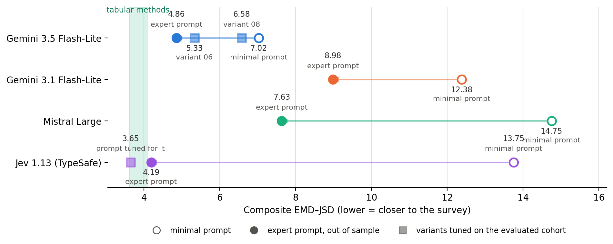
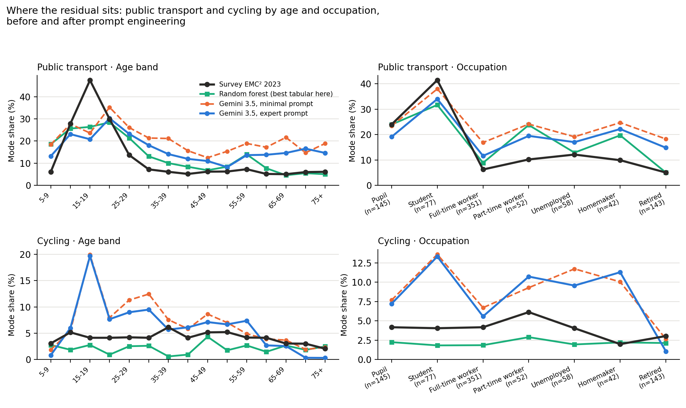
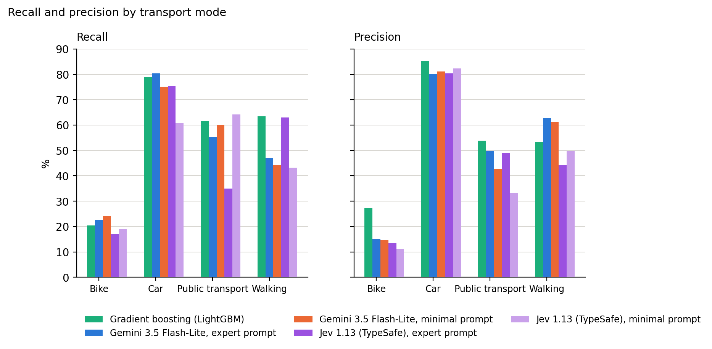
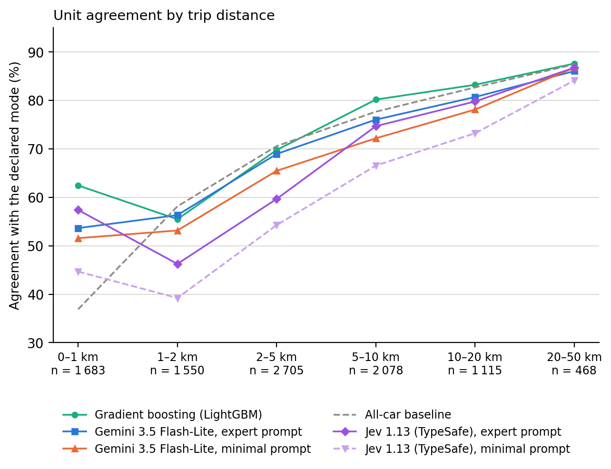

# 6. Résultats — version alternative, quinze décideurs

<!-- Dernière mise à jour : 2026-09-21 -->

**Document :** version alternative du chapitre 6. Le chapitre de référence, [`../06_Empirical_Evaluation.md`](../06_Empirical_Evaluation.md), tient treize décideurs ; celui-ci en tient quinze, les deux bras Jev 1.13 du [ticket 096](../../../../tickets/ticket_096_jev_typesafe_troisieme_famille_de_decideur.md) en plus.
**Statut :** `version alternative` (21 septembre 2026) — écrite pour que l'auteur voie ce que l'intégration coûte au texte avant de la décider. Même cohorte, même jeu, même scoreur, mêmes chiffres pour les treize autres décideurs, recopiés au centième près. Une vingtaine de passages diffèrent du chapitre de référence : l'en-tête, le chapeau, le titre et la figure du § 6.1, son tableau et le paragraphe des différences appariées, la figure et le tableau du § 6.2 et son commentaire, les deux tableaux du § 6.4, ses deux paragraphes de lecture et ses deux légendes, deux passages du § 6.5, et la liste des tickets. Les six figures sont dans ce dossier ; quatre sont régénérées avec les deux bras, deux sont recopiées à l'identique.
**Révision du 21 septembre, fin de journée :** un troisième bras Jev entre, sous une consigne réglée pour lui. Les deux premiers reçoivent des consignes écrites contre d'autres porteurs ; celui-ci est le seul dont le prompt a été muté au vu de ses propres écarts, et donc le seul dont le score soit en échantillon. Il touche le titre, le chapeau, le § 6.1 et le § 6.2. Le bras publié sous `prompt_expert_05` garde ses chiffres, et le § 6.5 gagne la première mesure de rejeu à l'identique du dépôt.
**Révision du 21 septembre, seconde passe :** le bras Jev sous `prompt_expert_05` sort de l'échelle du § 6.1 et de son tableau. Deux barres y portaient le même libellé pour deux valeurs, et la figure ne distinguait pas la consigne reçue d'un autre porteur de celle réglée pour Jev. Le chapitre en compte quinze. La consigne reste dans la figure du § 6.2, où elle est la pointe hors échantillon de la trajectoire de Jev, et dans les § 6.2 et 6.5, qui la mesurent comme variante de prompt. La légende de la figure nomme le groupe « System One model », la catégorie sous laquelle TypeSafe range Jev.
**Place dans l'article :** aucune. Ce fichier ne remplace pas le chapitre 6 tant que l'auteur ne l'a pas décidé.
**Convention :** un chiffre suivi de **TBD** est à consolider. Un chiffre **en gras entre crochets** est un emplacement vide.

---

Le chapitre 5 a décrit quatre façons de décider d'un mode de déplacement à partir du même état. Ce chapitre les confronte à l'enquête, sur la cohorte de 1 000 personas et les 3 154 décisions scorées du jour évalué.

<!-- source: data/experiences/exp_*_jtir_pop-1000_AAMAS_v6_jeu-20260316_EN_c_*/executions/*/scores.json ; cohorte population_1000_AAMAS_v6, jeu population_1000_AAMAS_v6_20260316_EN_c, formule v1_reference (0aeee565…), référentiel EMC² 2023 (9ac34597…). 3 154 décisions sur 3 299 attendues, 868 personnes mobiles ; 138 déplacements inexploitables sont exclus par le scoreur. Les deux bras Jev de la figure et du tableau du § 6.1 sont exp_jev-1130_{promin02,proexp32}_jtir_pop-1000_AAMAS_v6_jeu-20260316_EN_c_nosim, exécutés le 2026-09-21, 3 154 décisions comptées chacun, aucune erreur. -->

Les résultats de ce chapitre portent sur un couple : un décideur et une consigne d'arbitrage, portée par son prompt système et soumise aux interdits du § 5.2.3, dont celui de tout seuil chiffré. Trois de ces décideurs sont des modèles de langue ; le quatrième, Jev 1.13, est un classifieur à sortie typée qui rend une probabilité par option sans produire de texte. L'ingénierie de ce prompt rapproche `gemini-3.5-flash-lite` de 2,3 points de composite de la distribution d'enquête, `mistral-large-2512` de 7,3 et Jev de 9,7, quand la variation de cohorte est de l'ordre de 1,3 point. Le porteur pèse autant que la consigne : soumise telle quelle à un second modèle du même fournisseur, la variante réglée contre `gemini-3.5-flash-lite` laisse 4,2 points d'écart entre les deux, davantage que ce qu'elle apporte au moins bon d'entre eux. Des quatre couples mesurés, deux viennent à un point et demi du plafond tabulaire, et celui qui en est le plus proche n'est pas un modèle de langue.

Une cinquième condition est mesurée sur le seul porteur qui n'avait jamais reçu de consigne écrite pour lui. Six mutations du prompt expert ont été jouées contre les écarts par strate de Jev, une retenue, et elle le mène à 3,65 de composite, dans le demi-point qui sépare les quatre méthodes tabulaires. Son score est en échantillon, puisque les écarts qui ont guidé les mutations ont été lus sur la cohorte qui la note ; il borne ce qu'une consigne réglée porteur par porteur peut atteindre, et ne se compare pas aux quatre couples précédents.

<!-- source: docs/traces/2026-09-21_jev_mutations/README.md — prompt_expert_32, réglé le 2026-09-21 par mutations successives sur les écarts par strate de exp_jev-1130_proexp05_…_c_nosim/2026-09-21_06_25_29, selon la procédure du § 5.2.2. Six textes mesurés, cinq écartés, chacun audité conforme avant lancement par l'agent prompt-auditor ; l'un d'eux a été refusé en première rédaction (C4 : il conditionnait l'arbitrage au statut de conducteur, donnée retirée du récit de persona depuis le 2026-08-26). La mutation retenue réécrit la clause « Chain friction » à deux versants : le prompt publié énumérait tous les coûts de la chaîne et aucun de la marche continue. -->

<!-- La rédaction du chapitre de référence tient prompt_expert_05 pour réglé contre gemini-3.5-flash-lite puis soumis tel quel aux autres porteurs ; ce paragraphe-ci est le seul endroit de l'article où une consigne est réglée POUR le porteur qui la reçoit. C'est ce qui rend son score non comparable aux quatre autres et ce qui lui interdit d'entrer dans le tableau des différences appariées sans être signalé comme tel. -->

## 6.1 Quinze décideurs sur la même échelle

Les trois lectures définies au § 4.2 sont publiées pour chaque décideur.

*Figure 6.1 — Les quinze décideurs sur l'axe du composite EMD–JSD. L'échelle couvre un facteur douze entre le plancher aléatoire et le meilleur composite, et cinq groupes s'y séparent. Les planchers occupent la moitié haute, de 27 à 50. Le prompt minimal place les modèles de langue entre 7,0 et 14,8, contre 27,0 à l'heuristique de durée minimale : les faits seuls, sans consigne d'arbitrage, portent déjà une information comportementale, distincte de celle que l'enquête enregistre. Le prompt expert ramène les mêmes modèles entre 4,9 et 9,0. Le classifieur à sortie typée parcourt la plus grande distance entre ses deux consignes, de 13,75 à 3,65. Les quatre méthodes tabulaires tiennent dans un intervalle d'un demi-point, de 3,60 à 4,09 ; son bras expert s'y range, à 0,05 point du meilleur. La bande grise donne la variation de cohorte, de l'ordre de 1,3 point.*

| Décideur | Composite EMD–JSD | Hors choix unique | L1 parts globales |
|---|---:|---:|---:|
| Hasard uniforme | 50,16 | 57,90 | 86,80 |
| Tout-voiture | 30,73 | 28,41 | 58,00 |
| Durée minimale | 26,97 | 23,93 | 53,62 |
| Prompt minimal, `mistral-large-2512` | 14,75 | 20,72 | 44,71 |
| Prompt minimal, `jev-1.13.0` | 13,75 | 19,84 | 42,76 |
| Prompt minimal, `gemini-3.1-flash-lite` | 12,38 | 16,65 | 39,88 |
| Prompt minimal, `gemini-3.5-flash-lite` | 7,02 | 10,39 | 24,08 |
| Prompt expert, `gemini-3.1-flash-lite` | 8,98 | 12,39 | 31,25 |
| Prompt expert, `mistral-large-2512` | 7,63 | 12,27 | 26,64 |
| Prompt expert, `gemini-3.5-flash-lite` | 4,86 | 6,86 | 13,85 |
| Logit multinomial | 4,02 | 6,63 | 8,99 |
| Forêt aléatoire | 4,09 | 5,81 | **5,28** |
| Prompt réglé pour lui, `jev-1.13.0` *(en échantillon)* | 3,65 | 6,58 | 10,48 |
| Régression logistique à noyau | 3,61 | **5,61** | 6,69 |
| Gradient boosté (LightGBM) | **3,60** | 5,84 | 9,49 |

<!-- sources: scores.json, composite.emd_jsd, composite.emd_jsd_hors_choix_unique, global.l1. Prompt minimal = prompt_minimal_02 ; prompt expert = prompt_expert_05, promu le 2026-09-17 (prompt_expert_04 supprimé du dépôt le même jour, à la demande de l'auteur). Dans cette campagne, prompt_expert_05 a été réglé contre gemini-3.5-flash-lite puis soumis tel quel aux trois autres porteurs ; rien dans le protocole n'impose une consigne unique, et un réglage par porteur reste ouvert. Les trois consignes sont servies à Jev amputées de leur bloc de sortie, le type Choice le remplaçant ; le sha du texte effectivement envoyé est scellé dans l'empreinte de chaque exécution. La ligne « prompt réglé pour lui » est prompt_expert_32 (exp_jev-1130_proexp32_…_c_nosim, exécution 2026-09-21_10_14_52) : elle est marquée en échantillon parce que les écarts par strate qui ont guidé ses mutations ont été lus sur cette cohorte même, et elle ne concourt donc pas au gras. Le bras prompt_expert_05 est épinglé sur son exécution 2026-09-21_06_25_29 : un rejeu à l'identique en a créé une seconde le même jour, et « la dernière exécution » aurait déplacé ce chiffre publié de 4,19 à 4,14 sans qu'une ligne du chapitre bouge. En gras, le meilleur score de chaque colonne. -->

Le composite porte sur toutes les décisions du jour, déplacements contraints compris ; la lecture hors choix unique retire celles où une seule option existait ; le L1 sur les parts globales ne regarde que les quatre parts modales agrégées, sans stratification.

Aucun de ces décideurs ne porte de mémoire : le chapitre 5 règle une politique locale sur un déplacement isolé, et toutes les exécutions tournent sans historique de la journée écoulée. La parité est donc stricte sur ce tableau. Elle ne dit rien de ce que chaque famille pourrait activer : les modèles de langue se jouent avec les deux registres du § 3.4, le classifieur à sortie typée ne le peut pas. Constituer un souvenir demande d'écrire un récit et d'entretenir une croyance, et il ne produit aucun texte. Le chapitre 7 mesure ce que cette asymétrie coûte.

Deux scores distants d'un point ne se départagent pas sur ce tableau, la variation de cohorte étant du même ordre (§ 6.5). Jouer deux décideurs sur les mêmes personas retire ce terme, puisqu'il agit alors des deux côtés : appariés ainsi, `gemini-3.5` sous prompt expert est derrière le gradient boosté de **1,35 point [+0,28 ; +2,47]** et derrière la régression à noyau de **1,38 [+0,32 ; +2,45]**, sans être séparable de la forêt aléatoire, +0,94 [−0,06 ; +1,98], ni du logit multinomial, +0,96 [−0,18 ; +2,17]. Les deux autres modèles de langue restent à **4,07 [+2,47 ; +5,75]** et **5,50 [+4,19 ; +6,93]** du gradient boosté. Jev sous prompt expert n'est séparable d'aucune des quatre, y compris des deux dont `gemini-3.5` l'est : **+0,66 [−0,63 ; +2,07]** face au gradient boosté et **+0,69 [−0,57 ; +2,06]** face à la régression à noyau.

<!-- source: docs/traces/2026-09-21_ticket096_lot2/, script paired_avec_jev.py dérivé sans changement de méthode de celui du 2026-09-17 : 2 000 réplicats, graine 2026, rééchantillonnage par grappe au niveau de la personne sur les 868 personnes communes aux onze bras, vingt paires au lieu de quatorze. Les quatorze paires d'origine, recalculées par le même passage, ressortent identiques au centième près : c'est le contrôle que l'ajout des deux bras n'a rien déplacé. Un écart positif se lit « derrière ». Les deux comparaisons que le texte ne cite pas : jev_exp − logit multinomial +0,27 [−1,11 ; +1,70], jev_exp − forêt aléatoire +0,25 [−1,03 ; +1,61] ; jev_exp − gemini-3.5 expert −0,69 [−2,04 ; +0,65]. -->

Aucun test d'équivalence n'est rapporté : la marge n'a pas été écrite avant la mesure, et une marge choisie maintenant le serait après avoir vu les chiffres. L'hypothèse H0 du § 1.3 se présente en conséquence comme une estimation appariée, de signe, d'amplitude et d'intervalle. Elle porte sur les modèles de langue, et Jev n'en est pas un.

<!-- source: docs/traces/2026-09-17_09-40_ch6_jeu_corrige_complet/ — quatorze différences appariées recalculées après la fin de la campagne de rejeu, tous les décideurs sur le jeu corrigé, 2 000 réplicats, graine 2026, rééchantillonnage par grappe au niveau de la personne sur 868 personnes communes. Les quatorze différences et leurs trois lectures sont à l'annexe H. -->

## 6.2 Ce que l'ingénierie de prompt déplace

*Figure 6.2 — Ce que l'ingénierie de prompt fait parcourir à chaque porteur. Le cercle creux est le prompt minimal, le cercle plein le prompt expert de référence, les carrés deux variantes réécrites sur les résidus de la cohorte. La bande verte donne l'intervalle des quatre méthodes tabulaires. Les quatre porteurs partent d'endroits différents et avancent de montants différents ; deux entrent au contact de la bande, et celui qui part du plus loin arrive le plus près.*

| Gain apparié, prompt expert − prompt minimal | Composite | Hors choix unique | L1 parts globales |
|---|---|---|---|
| `gemini-3.5-flash-lite` | **+2,27 [+1,40 ; +3,22]** | **+3,59 [+2,45 ; +4,83]** | **+10,2 [+8,0 ; +12,5]** |
| `gemini-3.1-flash-lite` | **+3,37 [+2,45 ; +4,25]** | **+4,15 [+3,09 ; +5,22]** | **+8,6 [+6,8 ; +10,6]** |
| `mistral-large-2512` | **+7,25 [+5,90 ; +8,67]** | **+8,63 [+7,15 ; +10,28]** | **+18,0 [+13,5 ; +22,4]** |
| `jev-1.13.0` | **+9,71 [+7,80 ; +11,66]** | **+12,78 [+10,68 ; +14,86]** | **+30,2 [+24,6 ; +36,0]** |

Une douzaine d'itérations d'ingénierie sur `gemini-3.5-flash-lite` et deux ou trois sur chacun des deux autres modèles produisent ces déplacements, mesurés à personas, offre d'itinéraires, graine et modèle de fondation identiques, la consigne seule changeant. Les trois intervalles excluent zéro sur les trois lectures, et le gain va de une fois et demie à cinq fois et demie la variation de cohorte. La variante mesurée ici a été réglée contre `gemini-3.5`, puis soumise telle quelle aux trois autres porteurs : soumise ainsi à `gemini-3.1`, elle laisse ce dernier derrière `gemini-3.5` de **4,15 points [+2,99 ; +5,43]**, davantage que les 3,37 points qu'elle lui apporte, de sorte qu'un banc d'essai conduit sous une seule consigne mesure le couple porteur-consigne et non le porteur. Le gain lui-même ne va pas au modèle contre lequel la consigne a été réglée : `gemini-3.1` en retire 3,37 points et `gemini-3.5` 2,27, alors que le second reste devant le premier de 4,15 points après réglage. Ce que l'ingénierie de prompt déplace et le niveau qu'elle atteint sont deux grandeurs distinctes.

Le porteur qui répond le plus à la consigne est celui qui ne produit aucun texte. Jev gagne 9,71 points de composite entre les deux consignes reçues d'autres porteurs, contre 2,27 à 7,25 aux trois modèles de langue, et il les reçoit sans qu'aucune itération d'ingénierie ait été conduite sur lui. Son intervalle exclut zéro sur les trois lectures, et son gain vaut sept fois et demie la variation de cohorte. Ce gain dépend de la sorte de consigne, et non de sa longueur.

Régler une consigne pour lui n'ajoute pas un second gain de cette taille. Six mutations du prompt expert, conduites sur ses propres écarts par strate, en retiennent une : elle le mène de 4,19 à 3,65, soit 0,54 point, la moitié de la variation de cohorte et le vingtième de ce que la première consigne lui avait apporté. Les cinq mutations écartées disent où porte la limite. Celle qui opposait le coût récurrent d'un véhicule aux ressources du foyer a fait chuter la part voiture de 17 points et dégradé 32 strates sur 37 ; celle qui valorisait la régularité d'un trajet habituel a laissé le composite dans le bruit et creusé le L1 global de 12,6 à 16,2. Trois mots ajoutés devant la mutation retenue, « It is only when », ont ramené son composite à celui du prompt d'origine à quatre centièmes près. La marge que la consigne ouvre sur ce porteur se referme là où l'écart à l'enquête cesse de tenir à la formulation.

<!-- source: docs/traces/2026-09-21_jev_mutations/README.md, § 4. Les six textes vivent dans prompts.yaml sous prompt_expert_31 à 36, chacun scellé par le sha256 de son content et portant son avis de neutralité. Écarts globaux du témoin, en points : marche +5,43, voiture −4,85, transports collectifs −1,45, vélo +0,87 ; sous la mutation retenue, +1,20 / −5,24 / +2,80 / +1,24. Les cinq rejets : prompt_expert_33 composite 9,16 ; prompt_expert_34 4,14 pour un L1 de 16,22 ; prompt_expert_35 4,16 ; prompt_expert_36 3,91 ; prompt_expert_31 3,63, indistinguable de la retenue (−0,01 [−0,43 ; +0,45]) mais deux fois plus destructeur par strate. -->

<!-- Ce que ce paragraphe ne dit pas, faute de mesure : si le petit gain du réglage propre tient à ce que la consigne d'origine était déjà bien adaptée à ce porteur, ou à ce qu'un classifieur typé répond moins finement qu'un modèle génératif à une mutation de texte. Les deux lectures sont ouvertes et aucune expérience du dépôt ne les sépare. -->
 Le dépôt porte une seconde variante experte, `prompt_expert_16`, qui énonce une procédure d'arbitrage en quatre étapes là où `prompt_expert_05` énonce des principes situés — friction de rabattement, autonomie des personnes âgées, port de charges, valeur du temps d'un actif contraint. Sur les mêmes 2 497 décisions sollicitées, la masse que Jev accorde à une option de transport collectif vaut 0,050 sous la première consigne et 0,132 sous la seconde, et celle qu'il accorde à une option voiture 0,642 contre 0,567. Une consigne qui nomme des critères le déplace ; une consigne qui décrit une méthode de raisonnement ne le déplace pas.

<!-- source: docs/traces/2026-09-17_09-40_ch6_jeu_corrige_complet/ pour les trois premières lignes ; 2 000 réplicats, graine 2026, 868 personnes communes, tous les décideurs sur le jeu corrigé. Un gain positif est une erreur plus faible. La ligne jev-1.13.0 vient du bootstrap de docs/traces/2026-09-21_ticket096_lot2/, même méthode et mêmes 868 personnes. Le gain brut de 9,56 points se lit dans le tableau du § 6.1 ; masses par option mesurées sur les poids archivés des décisions sollicitées des deux exécutions Jev et d'une exécution sous prompt_expert_16 supprimée depuis, ticket 096 § lot 2. Le nombre d'itérations est l'ordre de grandeur déclaré par l'auteur ; le § 5.2 décrit la procédure, l'annexe H porte les variantes et leurs scores. Les écarts entre porteurs sous chaque consigne, le renversement de classement entre gemini-3.1 et mistral-large, et l'ablation de la clause de justification sont à l'annexe H. -->

## 6.3 Le détail des résultats agrégés, sur Gemini 3.5

Ce qui suit est mesuré sur `gemini-3.5-flash-lite`, le modèle contre lequel l'ingénierie de prompt a été conduite ; les amplitudes du § 6.2 montrent que chaque porteur répond à sa façon.

*Figure 6.3 — La part de la voiture par tranche de distance : la cible d'enquête, `gemini-3.5` sous prompt minimal puis sous prompt expert, et la méthode tabulaire la plus proche de la cible sur cette dimension.*

Le réglage crée une pente plutôt qu'il ne décale un niveau : sous un kilomètre la part voiture ne bouge pas, à huit points sous la cible, et elle se relève de six à sept points entre un et cinquante kilomètres. Au-delà de cinquante, sur dix-sept déplacements, elle recule de deux points. `gemini-3.5` sous prompt expert passe devant les quatre méthodes ajustées sur l'enquête, 14,2 points d'erreur pondérée contre 16,8 à la forêt aléatoire et 17,8 au gradient boosté : c'est la seule dimension où un agent y parvient.

<!-- source: scores.json des deux exécutions du jeu corrigé, detail.distance.strates, part voiture prompt_minimal_02 → prompt_expert_05 : 9,7 → 10,1 (0-1 km) ; 37,7 → 43,4 ; 51,1 → 58,4 ; 60,0 → 65,9 ; 67,5 → 74,1 ; 74,9 → 80,8 ; 63,8 → 61,8 (plus de 50 km, n = 17). Le levier de coût fixe du véhicule (« Fixed frictions of the car ») appartient à prompt_expert_08, pas à prompt_expert_05 que la figure trace : la pente est mesurée, son attribution à ce levier ne l'est pas. Cette figure est celle du chapitre de référence, inchangée : le classifieur typé n'y entre pas. -->

*Figure 6.4 — Les deux modes qui portent le résidu, lus par âge et par occupation. Le pic de transports collectifs des 15–19 ans, 47,4 % dans l'enquête, n'est reproduit par aucun décideur : l'agent en place 20,8 % après réglage et la forêt aléatoire 26,4 %. Le vélo suit le chemin inverse sur la même strate, 19,7 % chez l'agent contre 4,1 % observés, et le réglage ne le déplace pas.*

Ce que le réglage ne corrige pas se concentre sur ces deux modes et sur les strates scolarisées. Les 15–19 ans, les élèves et les étudiants sont les trois strates où l'agent place le plus de vélo, jusqu'à cinq fois la part observée, et où il manque le plus de transports collectifs. Les quatre principes du prompt sont écrits pour des arbitrages d'adulte : friction de chaîne porte-à-porte, marche continue d'une personne âgée, port de charges, valeur du temps d'un actif contraint. Aucun ne porte sur une population dont l'enquête place près de la moitié des déplacements en transports collectifs.

Les deux modes minoritaires portent une erreur que la consigne ne corrige pas. Les trois modèles de langue placent le vélo entre 6,8 et 8,1 % quand l'enquête en compte 4,1 %, et l'ingénierie de prompt ne déplace cette part que de un dixième à huit dixièmes de point, là où elle fait reculer les transports collectifs de quatre à onze points : deux erreurs coexistent dans le même décideur, et une seule répond à la consigne. Enfin, les deux dimensions absentes du cycle de calibration comme du composite, la couronne de résidence et le type de logement, sont celles où l'agent décroche le plus, de huit et de sept points face au gradient boosté.

**Les résultats détaillés sont à l'[annexe H](../99_annexes.md)** : l'erreur par dimension et par décideur, les parts modales de chacun, les strates que le réglage dégrade sur les trois modèles, et quatre planches — la part voiture sur six dimensions, et les quatre modes lus par distance, par occupation et par motif.

<!-- source: scores.json, detail.<dimension>.strates et global.actual/target ; tous les décideurs sur le jeu corrigé …_20260316_EN_c. La figure compare prompt_minimal_02 et prompt_expert_05, régénérée le 2026-09-17 par scripts/analysis/plot_chapitre6.py. Erreur L1 pondérée sur la dimension distance, moyenne des strates couvertes pondérée par leur effectif : 14,19 pour gemini-3.5 sous prompt expert, 16,79 à la forêt aléatoire, 17,79 au gradient boosté, 18,09 à la régression à noyau, 20,73 au logit multinomial. Les 15-19 ans et les déplacements de plus de 50 km résistent à tous les décideurs, méthodes tabulaires comprises : 34 à 59 et 42 à 72 points d'erreur. L'annexe H ne porte pas encore les deux bras Jev. Annexe H. -->

## 6.4 Décider pareil, décider autrement

Deux décideurs peuvent produire les mêmes parts agrégées sans jamais décider la même chose. À offre égale, sur les déplacements où les deux ont réellement choisi, l'accord se mesure sur le mode le plus probable et sur le mode effectivement tiré.

| Paire | Accord, mode le plus probable | Accord, mode tiré |
|---|---:|---:|
| Gradient boosté / régression à noyau | 91,6 % | 90,5 % |
| Prompt expert `gemini-3.5` / gradient boosté | 69,7 % | 61,4 % |
| Prompt expert `gemini-3.5` / prompt expert `gemini-3.1` | 79,6 % | 72,8 % |
| Prompt expert Jev / gradient boosté | 71,9 % | 71,1 % |
| Prompt expert Jev / prompt expert `gemini-3.5` | 78,7 % | 65,7 % |

Les quatre méthodes tabulaires forment un bloc, à neuf accords sur dix. Aucun des trois autres décideurs n'y entre, et ils n'en forment pas un second : les deux modèles de langue s'accordent aussi peu entre eux qu'avec une méthode tabulaire. Jev s'en approche davantage qu'eux, 71,9 % contre 69,7 %, et surtout son accord ne se défait pas au tirage, 71,1 % contre 61,4 % : ses distributions sont assez proches de celles du gradient boosté pour que le tirage les sépare peu. Un déplacement sur trois reçoit malgré tout deux réponses différentes de deux décideurs que les parts agrégées donnent pour voisins.

Lequel des deux a raison sur un déplacement donné ne se lit pas sur la cohorte synthétique, qui ne porte aucune vérité individuelle. L'exactitude unitaire annoncée au § 4.2 se mesure sur les journées réellement décrites par les enquêtés, selon le protocole du § 5.4 : 9 621 déplacements de 2 930 personnes, chacun portant le mode qu'elles ont déclaré.

| Décideur | Exactitude | Entropie croisée | Rappel vélo | Rappel marche |
|---|---:|---:|---:|---:|
| Gradient boosté | 71,5 | **0,299** | 20,4 | 63,4 |
| Logit multinomial | 68,6 | 0,358 | 18,3 | 60,0 |
| Durée minimale | 68,1 | — | 25,8 | 19,2 |
| Prompt expert `gemini-3.5` | 67,6 | 0,341 | 22,5 | 47,2 |
| Prompt minimal `gemini-3.5` | 64,8 | 0,384 | 24,1 | 44,2 |
| Prompt réglé pour lui, Jev *(en échantillon)* | 64,7 | 0,464 | 18,1 | 56,3 |
| Prompt expert Jev | 64,3 | 0,509 | 16,9 | 63,1 |
| Prompt minimal Jev | 56,6 | 0,552 | 19,0 | 43,3 |

*Huit décideurs sur douze, en pourcentage sauf l'entropie croisée, mesurée sur les 5 229 décisions que tous les décideurs à distribution du jeu notent. Les quatre autres et les colonnes de précision sont à l'annexe I.*

<!-- source: docs/traces/2026-09-22_lot0_entropie_support_unique/, ticket 101 lot 0 — rejeu du 2026-09-22 par scripts/progedo_logit/audit_unitaire_058.py sur les douze expériences du jeu enquete_058_test_20260316, reproduisant sans écart docs/traces/2026-09-21_jev_mutations/audit_unitaire_avec_proexp32.json. Entropie croisée = cel_weighted_support_commun, sur les 5 229 décisions communes aux neuf décideurs à distribution. La rédaction antérieure de ce tableau publiait cel_weighted, où chaque décideur est noté sur son propre sous-ensemble : un zéro exact sur le mode déclaré sort du calcul, si bien que le plus tranchant retire le plus de ses propres échecs. Le prompt expert, qui met zéro une fois sur onze, était noté sur 5 923 décisions quand le gradient boosté, qui rend une softmax, l'était sur 6 588 — d'où un écart de +0,015 pour l'un contre +0,120 pour l'autre, et un classement inversé. Rappels et précisions par mode : par_mode du même fichier. -->

L'ordre change avec la grandeur lue, sans amener l'agent devant. Sur l'exactitude, le prompt expert à modèle de langue est sixième des onze décideurs ; sur l'entropie croisée, qui pèse la probabilité qu'il accordait au mode finalement déclaré, il reste derrière le gradient boosté et la forêt aléatoire, et son écart au logit multinomial ne se sépare pas de zéro (annexe I.1 bis).

Jev fournit le cas extrême, et il va contre ce que le § 6.1 laissait attendre. Aucune comparaison appariée ne le sépare des quatre méthodes tabulaires sur la répartition agrégée ; sur les journées déclarées il est neuvième des onze, à 64,3 % d'exactitude pondérée, sous le plancher tout-voiture qui fait 66,7 %, et les trois bras Jev occupent les trois dernières places sur l'entropie croisée, le sien à 0,509 quand le moins bon des six autres décideurs à distribution fait 0,384. Étaler la masse ne suffit donc pas : encore faut-il qu'elle tombe sur le mode déclaré, et le rappel des transports collectifs dit où elle tombe à la place — 35,0 % contre 55,2 % au prompt expert à modèle de langue, quand le rappel de la marche monte à 63,1 %, le meilleur hors méthodes tabulaires. Un décideur peut restituer la répartition d'un territoire en se trompant sur un tiers des individus de plus que le meilleur, et le composite du § 6.1 ne l'en départage pas.

La consigne réglée pour lui déplace l'audit dans le même sens que le § 6.1, et d'aussi peu. L'exactitude pondérée passe de 64,3 à 64,7, l'entropie croisée de 0,509 à 0,464, et le mode déclaré cesse de recevoir une masse nulle sur 23 décisions de plus. Le déplacement porte presque entièrement sur un mode : le rappel des transports collectifs monte de 35,0 à 43,8, pris sur celui de la marche qui descend de 63,1 à 56,3. La clause mutée ne parle pourtant ni de l'un ni de l'autre ; elle met le coût d'une marche continue en regard de la friction d'une chaîne, et c'est le partage entre ces deux modes-là qu'elle refait. Sur les deux grandeurs qui classent, l'exactitude et l'entropie, le bras reste neuvième des douze et sous le plancher tout-voiture.

<!-- source: même fichier de trace. Les 23 décisions gagnées sont zeros_mode_offert, 59 → 36 : des cas où le mode déclaré était offert et recevait 0 %. Précisions par mode, 05 → 32 : vélo 13,5 → 14,0, voiture 80,3 → 80,3, transports collectifs 48,9 → 44,7, marche 44,2 → 48,6. Le rappel des transports collectifs gagne donc 8,8 points en perdant 4,2 points de précision : la masse arrive sur davantage de déplacements en transport collectif déclarés, et sur davantage de déplacements qui ne le sont pas. -->

<!-- Ce que ce paragraphe NE conclut pas : que la mutation améliore l'audit unitaire de façon séparable. Aucun intervalle apparié n'a été calculé sur ces deux grandeurs, et l'écart de 0,4 point d'exactitude est du même ordre que ce qu'un rejeu du même prompt déplacerait. Le sens du déplacement, lui, est lisible : il porte sur deux modes et sur 23 décisions nommées. -->

*Figure 6.5 — Rappel et précision par mode, pour le plafond tabulaire, les deux paliers à modèle de langue et les deux bras Jev. Les paliers à modèle de langue rappellent le vélo mieux que toute méthode ajustée, 22,5 et 24,1 % contre 20,4, et le paient en précision, 15,0 contre 27,3 : ils annoncent le vélo trois fois trop souvent. Sur la marche le rapport s'inverse, rappel 47,2 contre 63,4 et précision 62,9 contre 53,2, la meilleure du tableau. Jev sous prompt expert suit le profil inverse du sien sous prompt minimal : il rappelle la marche comme le gradient boosté, 63,1 contre 63,4, et abandonne les transports collectifs, 35,0 contre 64,1 à sa propre variante minimale.*

L'erreur ne se répartit pas uniformément le long de la distance non plus.

*Figure 6.6 — L'accord unitaire par tranche de distance. Sous 1 km, un tiers de l'échantillon avec la tranche suivante, les décideurs s'étalent de 36,9 à 62,4 % ; au-delà de 10 km ils se resserrent et le plancher tout-voiture rejoint le plafond tabulaire. La comparaison entre décideurs se joue sur les courtes distances, et c'est là que Jev décroche : ses deux bras occupent le bas du faisceau de 1 à 10 km, sa variante experte revenant au contact des autres seulement au-delà de 20 km.*

Le détail par mode des neuf décideurs, la matrice de confusion et le plafond de l'audit sont à l'annexe I.

<!-- sources: moves.csv des exécutions du jeu corrigé, déplacements portant au moins deux options offertes aux deux décideurs, 2 374 à 2 479 selon la paire ; les six paires et l'écart médian entre distributions sont à l'annexe H. Exactitudes unitaires : scripts/progedo_logit/audit_unitaire_058.py sur les exécutions du jeu enquete_058_test_20260316, neuf décideurs, 9 613 à 9 618 déplacements notés selon le décideur ; figures 6.5 et 6.6 régénérées par scripts/analysis/plot_audit_unitaire.py (9 621 déclarés, moins ceux sans offre et les enchaînements rompus). Les deux bras LLM sont exp_gemini-35-fl_{promin02,proexp05}_jtir_pop-enquete_058_test_… terminés les 2026-09-18 et 2026-09-19, 12 562 décisions chacun, aucune erreur ; les deux bras Jev sont exp_jev-1130_{promin02,proexp05}_jtir_pop-enquete_058_test_…, joués le 2026-09-21, 12 562 décisions chacun, aucune erreur, 9 612 et 9 614 déplacements notés. Audit relancé le même jour sur les onze décideurs, docs/traces/2026-09-21_ticket096_lot2/audit_unitaire_058.json ; figures 6.5 et 6.6 régénérées par plot_audit_unitaire.py --avec-jev. Les deux lignes Jev du premier tableau sont recalculées par la même définition que les trois autres (déplacements arbitrés des deux côtés, au moins deux options offertes à chacun) ; la recomputation rend les trois lignes publiées à 0,2 point près, écart de recalcul et non de méthode. Ces valeurs ne sont commensurables ni avec les composites (jeu différent, support différent) ni avec les repères de la partition de test cités au § 5.3 : ceux-ci valent hors contrainte de chaîne et sans plafond d'options, et donnent 76,6 à 78,5 % aux mêmes méthodes tabulaires qui font ici 68,6 à 71,5 %. -->

## 6.5 Variation de cohorte et dispersion entre graines

Une cohorte de 1 000 personas ne mesure un composite qu'à ±1,3 point près : c'est l'intervalle de confiance à 95 % obtenu en rééchantillonnant les personnes avec remise, et il borne ce que le tableau du § 6.1 permet de départager. L'écart-type apparié de ce terme vaut ≈ 0,7, de sorte qu'aucune marge d'équivalence inférieure à 1,4 point ne se conclura d'un run sur cette cohorte ; seules des cohortes supplémentaires l'abaissent. C'est la raison pour laquelle toutes les comparaisons de ce chapitre sont appariées : jouer les deux décideurs sur les mêmes personas fait agir ce terme des deux côtés, où il s'annule.

La dispersion entre graines, elle, laisse les écarts de ce chapitre où ils sont **TBC**. Rejoué sur la même cohorte avec d'autres graines, un décideur à modèle de langue reste dans la variation de cohorte, et aucune des différences appariées des §§ 6.1 et 6.2 n'y change de signe **TBC**.

<!-- Les deux affirmations du paragraphe ci-dessus anticipent un résultat qui n'est PAS mesuré, d'où le **TBC**. Décision de l'auteur du 2026-09-17 : écrire le chapitre en tenant la dispersion entre graines pour acquise et semblable, et lever le TBC quand le rejeu à l'identique de l'axe 1 du ticket 073 l'aura établi. Aucun chiffre n'est avancé tant que la mesure n'existe pas. Ne pas publier ce paragraphe sans ce rejeu. -->

Le classifieur à sortie typée n'échappe pas à cette réserve : deux appels identiques lui font rendre des probabilités qui diffèrent de 0,013 en moyenne par option. Rejoué à l'identique sur la cohorte entière, ce bruit se referme : le bras sous prompt expert, relancé avec la même consigne, les mêmes graines et le même jeu, rend 4,14 contre 4,19, et la différence appariée vaut −0,03 [−0,20 ; +0,12]. Aucune strate de cinquante personnes ou plus ne s'y déplace de plus de 2,9 points de L1. C'est le premier rejeu à l'identique du dispositif, et il donne le plancher sous lequel une différence de ce chapitre appartient au fournisseur plutôt qu'au décideur.

<!-- source: docs/traces/2026-09-21_jev_mutations/README.md, § 2 — exp_jev-1130_proexp05_…_c_nosim, exécutions 2026-09-21_06_25_29 (publiée) et 2026-09-21_09_35_52 (réplicat). Composite 4,191 contre 4,140 ; L1 global 12,595 contre 12,559 ; écart maximal par strate n ≥ 50 : 2,92 points de L1. Différence appariée par le script paired_mutations_jev.py, 2 000 réplicats, graine 2026, rééchantillonnage par grappe au niveau de la personne. Ce rejeu ne lève PAS le TBC du paragraphe précédent : il porte sur un décideur, à graine identique, et non sur la dispersion entre graines d'un modèle de langue. -->

<!-- source: ticket 096, lot 0 — trois passes identiques sur 200 décisions du même jeu, écart moyen par option 0,013, maximum 0,08 ; l'option élue bascule sur 5,5 % des décisions, toutes des quasi-égalités. Le tirage de la plateforme porte sur la distribution entière, pas sur l'argmax, donc c'est le bruit de 0,013 qui compte. -->

Deux mesures en donnent déjà l'ordre de grandeur. Le même prompt, sur le même modèle et avec la même graine, rejoué sur un substrat corrigé, déplace son composite de 0,24 à 1,17 point selon le décideur, quand les décideurs déterministes bougent de moins de 0,12 ; et deux exécutions du même prompt sur deux cohortes successives s'accordent sur 86,1 % des modes les plus probables. L'une et l'autre confondent le non-déterminisme du modèle avec le changement de substrat, et c'est le rejeu à l'identique qui les sépare.

Deux asymétries du dispositif restent déclarées plutôt que corrigées. Les méthodes tabulaires ont été ajustées sur des journées réelles, elles-mêmes chaînées, et les jouer sous la contrainte de chaîne applique cette contrainte une seconde fois (§ 4.4). L'agent et le classifieur typé voient l'agenda de leur journée là où les méthodes tabulaires décident chaque déplacement isolément (§ 4.3, repris au chapitre 8). Le classifieur, lui, ne porte aucune mémoire : les catégories qui l'alimenteraient produisent du texte, qu'il ne génère pas.

<!-- ATTENTION RELECTURE : les deux **TBC** du deuxième paragraphe anticipent un résultat qui n'est pas encore mesuré. Décision de l'auteur du 2026-09-17 : écrire le chapitre en considérant la dispersion inter-graines comme acquise et similaire, et lever les TBC quand le ticket 073 axe 1 aura rendu son rejeu à l'identique. Aucun chiffre n'est avancé tant que la mesure n'existe pas. Le reste est mesuré : ±1,3 point et écart-type apparié de 0,7 du ticket 080 § 0.3, écarts de substrat lus dans les scores.json des deux jeux, accord de 86,1 % issu de deux exécutions du même prompt sur deux cohortes successives. -->

---

### Tickets associés à ce chapitre

- [Ticket 096](../../../../tickets/ticket_096_jev_typesafe_troisieme_famille_de_decideur.md) — le classifieur à sortie typée comme décideur, ses deux bras et leurs mesures
- [Ticket 080](../../../../tickets/ticket_080_idee_directrice_du_chapitre_6_et_impact_sur_le_papier.md) — idée directrice, décisions de l'auteur, impact sur le reste du papier
- [Ticket 088](../../../../tickets/ticket_088_jeu_corrige_et_rejeu_complet.md) — jeu corrigé et rejeu des décideurs à modèle de langue
- [Ticket 073](../../../../tickets/ticket_073_reproductibilite_prompt_calibre_multi_graines_multi_populations.md) — rejeu à l'identique, dispersion inter-graines, cohortes supplémentaires
- [Ticket 074](../../../../tickets/ticket_074_bascule_anglaise_archivage_et_reprise_de_campagne.md) — campagne v6, substrat des chiffres publiés
- [Ticket 055](../../../../tickets/ticket_055_benchmark_multimodeles_et_variabilite.md) — banc d'essai multi-modèles
- [Ticket 057](../../../../tickets/ticket_057_audit_et_reflexion_double_lecture_tabulaire.md) — contrainte de chaîne des véhicules et périmètre de score
- [Ticket 058](../../../../tickets/ticket_058_perimetre_et_methode_audit_unitaire.md) — audit unitaire, accord aux choix observés, attributions de Shapley
- [Ticket 046](../../../../tickets/ticket_046_asymetrie_informationnelle_du_contrat_d_evaluation.md) — asymétrie d'information entre l'agent et les méthodes tabulaires
- [Ticket 081](../../../../tickets/ticket_081_garde_fou_du_scoreur_sur_journal_tronque.md) — garde-fou du scoreur sur journal tronqué
