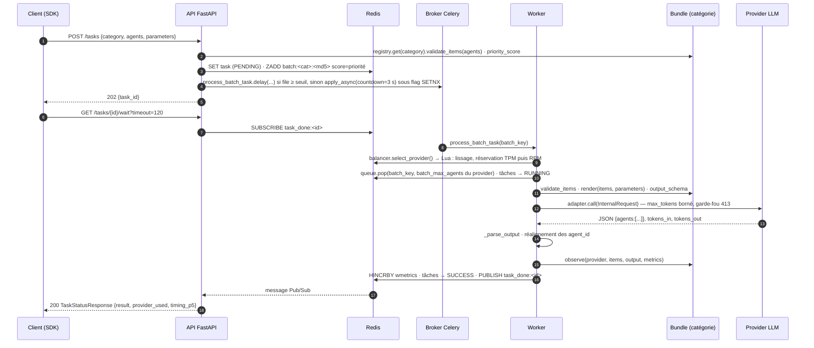

# Architecture

## Ports & adapters

Le gateway est organisé en couches concentriques. Au centre, `core/` : les modèles
pydantic (`LLMRequest`, `Task`, `AgentItem`, `AgentResponse`, `InternalRequest`), la clé de
lot (`compute_batch_key`), la séquence SWRR (`build_swrr_sequence`). Aucun I/O, aucun import
de Redis, Celery, httpx ou FastAPI. Autour, `ports/` : des `Protocol` qui disent ce dont le
gateway a besoin sans dire comment — `TaskStore` / `SyncTaskStore`, `BatchQueue`,
`RateLimiter`, `MetricsSink`, `LLMAdapter`, et le contrat de catégorie
(`CategoryBundle`, `CategorySpec`, `ObserveContext`). Puis les implémentations : `infra/redis`
(scripts Lua pour la réservation atomique, hash `wmetrics`, Pub/Sub), `infra/memory` (pur
Python, pour les tests et un futur mode embarqué), `adapters/` (un traducteur par API de
fournisseur). Enfin les points d'entrée : `api/` (FastAPI), `worker/` (Celery), `cli.py`,
`sdk/` (client).

## Les cinq contrats import-linter

Vérifiés par `lint-imports` depuis la racine du dépôt (`.importlinter`), en CI et par `make
lint-imports`. Ce sont des contrats **forbidden** : le module source ne peut importer aucun
des modules interdits, directement ou transitivement.

| Contrat | Source | Interdit | Pourquoi |
|---|---|---|---|
| `gateway-sans-metier` | `llm_gateway` | `mobility_core`, `mobility_llm`, `llm_module` | le gateway ne connaît aucun métier ; un import inverse recréerait le paquet unique |
| `domaine-sans-gateway` | `mobility_core` | `llm_gateway`, `mobility_llm`, `llm_module`, `redis`, `celery`, `httpx`, `fastapi`, `jinja2` | le domaine de l'enquête est utilisable sans LLM ni infra (eqasim, notebooks, scripts) |
| `colle-sans-coquille` | `mobility_llm` | `llm_module` | la colle importe les nouveaux paquets, pas la coquille dépréciée |
| `core-pur` | `llm_gateway.core` | `llm_gateway.{infra,api,worker,adapters,prompts}`, `redis`, `celery`, `httpx`, `fastapi` | le domaine pur reste testable sans rien |
| `ports-purs` | `llm_gateway.ports` | `llm_gateway.{infra,api,worker,adapters}`, `redis`, `celery`, `httpx` | un port ne dépend que du core |

`mobility_llm` peut importer `llm_gateway` et `mobility_core` ; c'est la seule flèche
autorisée entre les trois paquets.

## Composition explicite

Rien ne se construit à l'import. Les fabriques assemblent les dépendances et les injectent :

- **API** : `create_app(config=None, deps=None)` → `build_deps(settings, registry=None)`
  construit deux clients Redis (sync et async), `RedisTaskStore`, `RedisBatchQueue`,
  `RedisRateLimiter`, `RedisMetricsSink`, `LoadBalancer`, et le `CategoryRegistry`
  (`get_registry()` depuis les entry points, ou celui passé). Le conteneur `GatewayDeps` est
  attaché à `app.state.deps` ; les routes le lisent, jamais un singleton. Le lifespan remet
  à zéro les fenêtres RPM/TPM et réchauffe la connexion au broker — deux gestes de démarrage
  de l'API, pas des effets de bord d'import.
- **Worker** : `build_worker_runtime(settings, registry=None)` construit le même jeu avec le
  seul client sync (`WorkerRuntime`), au premier traitement (`get_worker_runtime()` en
  `lru_cache`) — un worker s'importe sans Redis. `celery_app = create_celery_app(get_settings())`
  reste au niveau module parce que la ligne de commande Celery l'exige, mais construire l'app
  ne touche pas à Redis (connexion broker paresseuse).
- **Tests** : `create_app(settings, deps=GatewayDeps(…ports mémoire…, registry=build_registry()))`.
  C'est ce que fait `tests/integration/conftest.py`.
- **Settings** : `Settings()` lit `providers.yaml` et l'environnement, calcule
  `batch_max_agents` par provider ; `get_settings()` (`lru_cache`) filtre les providers sans
  clé. Aucun accès Redis ni réseau.
- **Logging** : `configure_logging()` est appelé par les fabriques (`create_app`,
  `create_celery_app`), idempotent. Il remplace le handler loguru par défaut par un handler
  au niveau `LOG_LEVEL` et, si `SERVICE_NAME` est défini, ajoute un fichier
  `APP_WORKDIR/<SERVICE_NAME>.log`. Un hôte qui importe seulement le SDK garde ses handlers.

## Ce que le gateway ne sait pas

Il ne sait pas ce qu'est un persona, un mode de transport, une trajectoire, une météo. Il ne
sait pas non plus ce que mesure le score de priorité d'un lot (pour la mobilité : un
horodatage de départ, le plus petit du lot). Il sait : recevoir des items avec un `agent_id`,
demander à la catégorie de les valider, rendre un template avec eux, appeler un fournisseur
en respectant ses quotas, vérifier que la réponse est une liste d'objets porteurs d'un
`agent_id`, réaligner ces identifiants, découper la réponse par tâche, et donner la réponse
validée au hook `observe` de la catégorie pour qu'elle compte ce qui l'intéresse.

Trois traces du passé restent volontairement, notées comme hypothèses du ticket 037 :
`AgentResponse` garde les champs typés « options » (`probabilities`, `chosen_index`,
`mode`) parce que le contrat HTTP consommé par le SDK ne bouge pas (H5) ; le collecteur
Prometheus garde les familles métier parce que Grafana les cite (H11) ; `providers.yaml`
reste une donnée du paquet et y est réécrit (H8).

## Flux d'une requête

En cas d'erreur du provider, le worker met le fournisseur en cooldown ou en désactivation,
remet le lot en file et le rejoue — sur le même provider (5xx, 429, 400 apprise) ou sur un
autre (parse, 4xx, capacité) — selon la table de [Erreurs et alarmes](../reference/erreurs-alarmes.md).

## Ce qui est prévu ensuite

Un port d'exécution qui permette un exécuteur in-process sans Celery ; un paramétrage en
couches préfixé `LLM_GATEWAY_` avec `providers.yaml` hors du paquet ; un adapter
OpenAI-compatible générique ; l'exposition des familles métier déclarée par le bundle. Ces
points sont listés dans le ticket 037 comme itérations suivantes.
