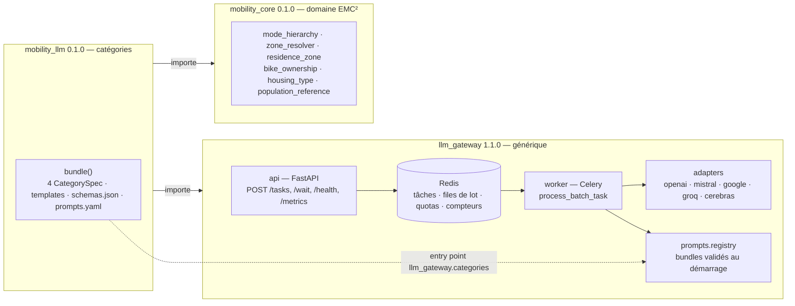

# llm-gateway

Gateway asynchrone multi-fournisseur pour appels LLM à sortie structurée. Un client soumet
un lot d'items par **catégorie** ; le gateway regroupe les lots compatibles en un seul prompt,
choisit un fournisseur selon ses quotas, appelle le modèle, valide le JSON retourné contre
le schéma de la catégorie et rend à chaque `agent_id` son résultat.

Le gateway **ne contient aucun prompt et ne connaît aucun métier**. Les catégories sont
apportées par des *bundles* installés à côté de lui et découverts par l'entry point
`llm_gateway.categories`. Cette documentation couvre le paquet `llm_gateway` (version
1.1.0) ; les deux paquets frères ont leur README.

## Les trois paquets



| Paquet | Rôle | Dépend de |
|---|---|---|
| `llm_gateway` | API, worker, adapters, balancer, moteur Jinja2 sans contenu, télémétrie, SDK, config | rien du dépôt |
| `mobility_core` | couronnes, zones fines, hiérarchie des modes, équipement, logement, cadrage de population ; aucune dépendance LLM ni infra | rien du dépôt |
| `mobility_llm` | persona `AgentSpec`, quatre catégories, variantes de prompt, choix modal, métriques métier ; s'enregistre auprès du gateway | les deux autres |

Les flèches sont des contrats vérifiés par import-linter (5 contrats, `.importlinter` à la
racine du dépôt) : le gateway n'importe jamais la mobilité, le domaine n'importe ni le gateway
ni une infra, `llm_gateway.core` et `llm_gateway.ports` restent purs.

## Par où commencer

| Vous voulez… | Page |
|---|---|
| obtenir une première réponse, de zéro | [Première requête](tutoriels/premiere-requete.md) |
| brancher un nouveau fournisseur LLM | [Ajouter un provider](guides/ajouter-un-provider.md) |
| écrire votre propre catégorie de prompt | [Ajouter une catégorie](guides/ajouter-une-categorie.md) |
| comprendre pourquoi un lot fait 2 agents et pas 20 | [Régler les quotas](guides/regler-les-quotas.md) |
| lancer ou écrire des tests | [Tester](guides/tester.md) |
| la liste des variables d'environnement | [Réglages](reference/reglages.md) |
| les endpoints et leurs codes | [API HTTP](reference/api-http.md) |
| le client Python | [SDK Python](reference/sdk-python.md) et [API Python](reference/api-python.md) |
| les familles Prometheus | [Métriques](reference/metriques.md) |
| ce que fait le worker d'une erreur | [Erreurs et alarmes](reference/erreurs-alarmes.md) |
| le pourquoi de la structure | [Architecture](explications/architecture.md), [Batching, SWRR, disjoncteur](explications/batching-swrr-disjoncteur.md) |
| les décisions prises | [ADR 0001](adr/0001-trois-paquets.md), [ADR 0002](adr/0002-hook-de-categorie.md) |

## En trois commandes

```bash
pip install -e ./mobility_core -e ./llm_gateway[test] -e ./mobility_llm   # depuis la racine du dépôt
llm-gateway serve --port 8000                                             # l'API (Redis attendu sur localhost:6379)
llm-gateway worker --concurrency 25 --pool threads                        # le worker, autre terminal
```

Sans bundle installé, `llm-gateway categories` rend le code 1 et toute requête est refusée
en 422. Avec `mobility_llm`, quatre catégories sont servies.

## État du chantier

Ticket 037, itération 1 (2026-09-07) : trois paquets installables, coquille `llm_module`
dépréciée (retrait prévu en 2.0), 233 tests gateway, 5 contrats import-linter tenus. Reporté :
préfixe `LLM_GATEWAY_` des variables d'environnement, `providers.yaml` hors du paquet, adapter
OpenAI-compatible générique, exécuteur sans Celery, authentification, licence
([changelog](changelog.md)).
